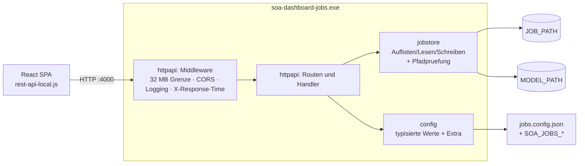

# soa-dashboard-jobs

Housekeeping-Backend des ESB/SOA-Dashboards, in Go. Es liest und schreibt
Jobdefinitionen, Logdateien und Modelldaten in lokalen Verzeichnissen und
beantwortet die REST-Aufrufe, die die React-Oberflaeche aus
[`soa-dashboard`](../soa-dashboard) an ihr "File-Backend" richtet.

Der Dienst ist eine Portierung von `backend-jobs` aus dem `soa-dashboard`-Repository
(Koa/Node). Das Protokoll ist unveraendert: die Oberflaeche spricht ohne Anpassung
mit dieser Version.

## Warum Go

- **Paketierung.** Die Node-Variante wurde mit `zeit/pkg` zu einer `.exe`
  gebuendelt. `pkg` laedt dafuer zur Bauzeit Node-Binaries herunter, was hinter
  dem Proxy scheitert und den dokumentierten Umweg ueber `~/.pkg-cache`
  erzwingt. `go build` erzeugt die `.exe` ohne Netzzugriff.
- **Abhaengigkeiten.** Sieben Routen Dateizugriff brauchten Koa, koa-router,
  koa-bodyparser, `@koa/cors`, moment und ramda. Diese Fassung kommt ohne eine
  einzige Fremdbibliothek aus.

Die Authentisierung bleibt im `soa-dashboard`-Repository in Node: die
LDAP-Bibliotheken haengen an Nodes `net`-Modul.

## Architektur



| Paket | Aufgabe |
|---|---|
| `internal/config` | Konfiguration aus JSON-Datei und Umgebungsvariablen |
| `internal/jsonutil` | JSON ohne HTML-Escaping, Schluesselreihenfolge erhalten |
| `internal/jobstore` | saemtliche Dateizugriffe samt Pfadpruefung |
| `internal/httpapi` | Routen, Handler und Middleware |

## Konfiguration

`jobs.config.json` wird zuerst im Arbeitsverzeichnis gesucht, dann neben der
ausfuehrbaren Datei; ein anderer Pfad geht ueber `-config`. Vorlage:
`jobs.config.example.json`.

```json
{
  "JOB_PATH": "C:/Dashboard",
  "MODEL_PATH": "C:/DashboardModel",
  "LOCAL_SERVER_PORT": "4000",
  "QUEUE_MAP_URL": "http://example.com/ceiser.interfaces/SenderFQN2QueueName.json"
}
```

- `JOB_PATH` und `MODEL_PATH` sind Pflicht. Fehlen sie, startet der Dienst nicht.
- `LOCAL_SERVER_PORT` ist optional, Standard `4000`.
- Beliebige weitere Schluessel sind erlaubt und ueber `GET /config/:name`
  abrufbar. Die Oberflaeche nutzt das fuer `QUEUE_MAP_URL`.

**Achtung, Windows-Pfade.** `JOB_PATH` und `MODEL_PATH` muessen im
Windows-Format stehen (`C:/Dashboard` oder `C:\\Dashboard`), nicht im
POSIX-Format einer Git-Bash-Shell (`/c/Users/...`). Ein POSIX-Pfad wird von Go
nicht erkannt und **unbemerkt** relativ zur aktuellen Laufwerkswurzel aufgeloest
- aus `/c/Users/xyz/Dashboard` wird so z. B. `C:\c\Users\xyz\Dashboard`. Der
Dienst startet dabei anstandslos und legt das Verzeichnis an; nur an einer
unerwarteten Stelle. Das ist die mit Abstand haeufigste Fehlkonfiguration -
nach dem Anlegen der Konfigurationsdatei immer pruefen, wo `JOB_PATH`
tatsaechlich gelandet ist.

Jeder Schluessel laesst sich mit `SOA_JOBS_<SCHLUESSEL>` ueberschreiben:

```powershell
$env:SOA_JOBS_JOB_PATH = "D:/Jobs"
.\soa-dashboard-jobs.exe
```

Reihenfolge: Umgebungsvariable vor Datei vor Standardwert. Ein einzelnes
Positionsargument ueberschreibt den Port, wie in der Node-Fassung:

```powershell
.\soa-dashboard-jobs.exe 4001
```

Beide Optionen lassen sich kombinieren - `-config` waehlt die Konfigurationsdatei,
das Positionsargument dahinter ueberschreibt darin nur den Port:

```powershell
.\soa-dashboard-jobs.exe -config D:/conf/jobs.config.json 4001
```

### Umstieg von der Node-Fassung

`customisation/jobs.config.js` wird zu `jobs.config.json` - dieselben
Schluessel, nur als JSON statt als CommonJS-Modul:

| vorher (`jobs.config.js`) | jetzt (`jobs.config.json`) |
|---|---|
| `module.exports = { JOB_PATH: "C:/Dashboard", ... }` | `{ "JOB_PATH": "C:/Dashboard", ... }` |

Port und Protokoll bleiben gleich, die Oberflaeche muss nicht neu gebaut werden.

## Endpunkte

Alle Antworten haben Status 200, auch im Fehlerfall - Fehler stehen im Rumpf.
Das entspricht der Node-Fassung, auf die sich der axios-Client der Oberflaeche
stuetzt.

| Route | Rumpf | Antwort |
|---|---|---|
| `GET /checkalive` | – | `{"result":true,"env":{…},"process-start":"a few seconds ago","uptime-in-ms":1234,"version":"1.2.3"}` |
| `GET /jobs` | – | `{"jobs":["eins.job.json"]}` |
| `GET /job/:jobname` | – | `{"status":"ok","job":"<Dateiinhalt>"}` |
| `POST /job/save` | `{"jobname","chunk","append"}` | `{"result":"ok"}` |
| `PUT /log` | `{"destination", …}` | `{"result":"ok"}` |
| `GET /model/:name` | – | `{"status":"ok","model":"<Dateiinhalt>"}` |
| `GET /config/:name` | – | `{"status":"ok","config":"<Wert>"}` |

- Datei-Inhalte kommen als Zeichenkette zurueck, nicht als geparstes JSON.
- `GET /model/:name` ergaenzt `.json`, `POST /job/save` ergaenzt `.job.json`,
  `PUT /log` ergaenzt `.log`. `GET /job/:jobname` ergaenzt dagegen nichts -
  `:jobname` muss die volle Datei **einschliesslich** `.job.json` enthalten,
  genau wie im Node-Original, weil die Oberflaeche die Endung bereits
  client-seitig anhaengt.
- `PUT /log` haengt den Rumpf ohne das Feld `destination` samt `,\n` an.
- `GET /config/:name` meldet `nok`, wenn der Wert fehlt oder leer ist.
- Sowohl Lese- als auch Schreibzugriffe (`GET /job`, `GET /model`, `POST /job/save`,
  `PUT /log`) sind auf direkte Eintraege in `JOB_PATH` bzw. `MODEL_PATH` beschraenkt.
  Unterverzeichnisse, absolute Pfade und `..` werden mit `invalid file` abgelehnt,
  weil alle vier Routen denselben Pfadpruefungscode in `internal/jobstore` nutzen.

## Entwickeln

```bash
go test ./...        # Tests
go vet ./...         # statische Pruefung
go run . 4001        # lokal starten
```

## Bauen

```powershell
.\build.ps1
```

Erzeugt `soa-dashboard-jobs.exe` fuer Windows amd64 und stempelt die Version
aus `git describe` ein; sie erscheint in `/checkalive` und im Startbanner.
Ohne das Skript genuegt:

```bash
go build -ldflags "-X main.version=1.2.3" -o soa-dashboard-jobs.exe .
```

## Unterschiede zur Node-Fassung

1. **Fehlertexte.** Statt `ENOENT: no such file or directory, open '…'` steht
   der Go-Text im Feld `status`. Die Struktur der Antwort ist gleich; die
   Oberflaeche wertet den Text nicht aus.
2. **Konfiguration.** JSON-Datei plus `SOA_JOBS_*` statt eines
   CommonJS-Moduls - Go kann kein JavaScript einbinden.
3. **Verzeichnisanlage.** Fehlende Elternverzeichnisse von `JOB_PATH` werden
   mit angelegt. Die Node-Fassung legte nur die letzte Ebene an.
4. **Version.** Kommt aus `-ldflags` statt aus `frontend/package.json`.
5. **Doppelpunkt im Dateinamen.** Job-, Log- und Modellnamen mit `:` werden bei
   Lese- wie Schreibzugriffen mit `invalid file` abgelehnt. Auf NTFS eroeffnet
   ein Doppelpunkt einen alternativen Datenstrom; die Node-Fassung schrieb
   dadurch unbemerkt in einen versteckten Stream statt in eine Datei. Go
   schlaegt stattdessen kontrolliert fehl.
6. **Portpruefung beim Start.** Ein ungueltiges Portargument (nicht
   numerisch, `0` oder ausserhalb von 1-65535) wird beim Start abgelehnt.
   Die Node-Fassung akzeptierte auch `0` und band dabei einen zufaelligen,
   vom Betriebssystem vergebenen Port, waehrend sie weiterhin Port 0
   meldete.
7. **`process-start` in `/checkalive`.** Die relative Zeitangabe bildet die
   Schwellenwerte von momentjs nach, einschliesslich seines gregorianischen
   Monats von 146097/4800 Tagen.
8. **Zu grosser Anfragerumpf.** Ueber 32 MiB warf koa-bodyparser eine
   Ausnahme, die Koa mit Status 413 beantwortete. Dieser Dienst antwortet
   stattdessen mit Status 200 und `{"result":"http: request body too large"}`,
   konsistent mit der Regel, dass jede Route mit 200 antwortet. Von der
   Oberflaeche aus ist das nicht erreichbar, weil sie in 64-KiB-Stuecken
   sendet.
9. **Zahlenwerte in `/log`.** `StripKey` uebernimmt Werte byteweise, daher
   bleibt `1.50` als `1.50` erhalten und eine 21-stellige Ganzzahl behaelt
   alle Stellen. Die Node-Fassung ging den Umweg ueber `JSON.parse`/
   `JSON.stringify`, wodurch `1.5` geschrieben und Praezision oberhalb von
   2^53 verloren wurde. Das Go-Verhalten ist das sicherere, aber die
   Logbytes sind fuer solche Eingaben nicht mehr identisch mit denen der
   Node-Fassung.
10. **Bindung nur an localhost.** Der Dienst lauscht ausschliesslich auf
    `127.0.0.1`, die Node-Fassung band alle Schnittstellen. Der Dienst kennt
    keine Authentisierung und spiegelt jeden Origin zurueck; beide
    dokumentierten Einsatzarten (SPA und vorgelagerter Webserver) sprechen
    ihn ohnehin vom selben Rechner aus an. Wird ein Zugriff von einem
    anderen Rechner benoetigt, gehoert ein Reverse-Proxy davor - nicht eine
    Aenderung an dieser Binary.

## Lizenz

Intern.
