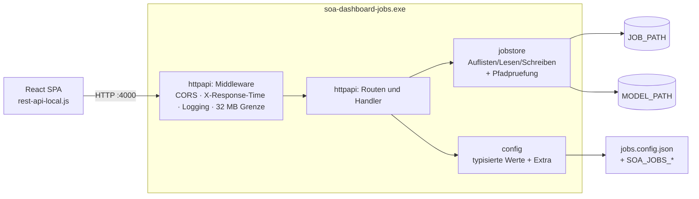

# Go Port of `backend-jobs` Implementation Plan

> **For agentic workers:** REQUIRED SUB-SKILL: Use superpowers:subagent-driven-development (recommended) or superpowers:executing-plans to implement this plan task-by-task. Steps use checkbox (`- [ ]`) syntax for tracking.

**Goal:** Reimplement the Koa/Node housekeeping backend `backend-jobs` as a dependency-free Go service that the existing React SPA can talk to without any frontend change.

**Architecture:** A single `net/http` server with four middleware layers (logging, response timing, CORS, body limit) in front of a Go 1.22 `ServeMux`. Handlers are thin and delegate to two leaf packages: `internal/config` (JSON file plus `SOA_JOBS_*` environment overrides) and `internal/jobstore` (all filesystem work, including the path-containment rule). `internal/jsonutil` holds the two JSON encoding rules the port depends on.

**Tech Stack:** Go 1.22, standard library only. No third-party modules. PowerShell build script producing a Windows amd64 binary.

**Spec:** `docs/superpowers/specs/2026-09-21-soa-dashboard-jobs-go-port-design.md`

## Global Constraints

- **Go 1.22.** `go.mod` declares `go 1.22`. Routing relies on the Go 1.22 `ServeMux` method-and-wildcard patterns (`GET /job/{jobname}`) and `r.PathValue`.
- **Zero third-party dependencies.** `go.mod` must have no `require` block for anything outside the standard library. If a task seems to need a library, it does not — write the twenty lines instead.
- **Module path is `soa-dashboard-jobs`.** Imports look like `soa-dashboard-jobs/internal/config`.
- **Strict drop-in.** Every route answers HTTP 200, including on error. Errors are carried inside the body as `{"result": …}` (write routes) or `{"status": …}` (read routes). File contents are returned as raw strings, never parsed.
- **No HTML escaping in JSON.** Every JSON byte the service emits — responses and log-file content alike — goes through an encoder with `SetEscapeHTML(false)`, so `<`, `>` and `&` stay literal the way `JSON.stringify` writes them. Never use `json.Marshal` directly for output.
- **German user-facing strings and comments.** Log messages, the startup banner, error text written for operators, and code comments are German, matching the `soa-dashboard` repo. Identifiers, JSON keys and the protocol-level strings `ok`, `nok` and `invalid file` stay English — they are the wire contract.
- **Use ASCII in German text.** Write `ue`, `oe`, `ae`, `ss` rather than umlauts, matching the existing console output style and avoiding console codepage problems on Windows.
- **Repository root is `C:\dev\soa-dashboard-jobs`.** All paths below are relative to it.
- **Every task ends with a commit.** Run `gofmt -l .` (must print nothing), `go vet ./...` and `go test ./...` before committing; all three must be clean. The Go snippets in this plan are not always gofmt-aligned — run `gofmt -w .` after pasting rather than matching the plan's whitespace by hand.

## File Structure

| File | Responsibility |
|---|---|
| `go.mod` | Module declaration. No dependencies. |
| `internal/config/config.go` | Read `jobs.config.json`, apply `SOA_JOBS_*` overrides, expose typed fields plus the full key map. |
| `internal/config/config_test.go` | Loading, precedence, defaults, validation. |
| `internal/jsonutil/jsonutil.go` | `Marshal` without HTML escaping; `StripKey` removing a top-level key while preserving key order. |
| `internal/jsonutil/jsonutil_test.go` | Escaping and key-order guarantees. |
| `internal/jobstore/store.go` | List, read, write and append files under `JOB_PATH` / `MODEL_PATH`; the containment rule; extension conventions. |
| `internal/jobstore/store_test.go` | Containment, extensions, append vs. truncate. |
| `internal/httpapi/humanize.go` | moment's `.from()` equivalent for `/checkalive`. |
| `internal/httpapi/humanize_test.go` | Bucket boundaries. |
| `internal/httpapi/middleware.go` | Body limit, CORS, `X-Response-Time`, request logging. |
| `internal/httpapi/middleware_test.go` | Header behaviour, preflight, oversized bodies. |
| `internal/httpapi/router.go` | `Server` struct, route table, `writeJSON`. |
| `internal/httpapi/handlers.go` | One handler per endpoint. |
| `internal/httpapi/handlers_test.go` | Per-endpoint response shapes against a temp directory. |
| `main.go` | Config path resolution, port argument, `MkdirAll`, banner, `ListenAndServe`. |
| `main_test.go` | Port argument handling, directory creation, banner content. |
| `jobs.config.example.json` | Template for operators. |
| `build.ps1` | Windows build with version stamping. |
| `README.md` | Purpose, architecture, configuration, endpoints, build, run, migration. |

`.gitignore` and the spec already exist in the repo from the design commit.

---

### Task 1: Module scaffold and configuration

**Files:**
- Create: `go.mod`
- Create: `internal/config/config.go`
- Test: `internal/config/config_test.go`

**Interfaces:**
- Consumes: nothing.
- Produces:
  - `config.Config` struct with fields `JobPath string`, `ModelPath string`, `Port string`, `Extra map[string]string`
  - `config.Load(path string) (*Config, error)`
  - `(*Config).SetPort(port string)`
  - constants `config.KeyJobPath = "JOB_PATH"`, `config.KeyModelPath = "MODEL_PATH"`, `config.KeyPort = "LOCAL_SERVER_PORT"`, `config.EnvPrefix = "SOA_JOBS_"`

- [ ] **Step 1: Create the module**

```bash
cd /c/dev/soa-dashboard-jobs
go mod init soa-dashboard-jobs
```

Then edit `go.mod` so it reads exactly:

```
module soa-dashboard-jobs

go 1.22
```

- [ ] **Step 2: Write the failing test**

Create `internal/config/config_test.go`:

```go
package config

import (
	"os"
	"path/filepath"
	"testing"
)

// writeConfig legt eine Konfigurationsdatei im Temp-Verzeichnis des Tests an.
func writeConfig(t *testing.T, content string) string {
	t.Helper()

	path := filepath.Join(t.TempDir(), "jobs.config.json")
	if err := os.WriteFile(path, []byte(content), 0o644); err != nil {
		t.Fatalf("Konfigurationsdatei konnte nicht geschrieben werden: %v", err)
	}
	return path
}

func TestLoadReadsAllKeys(t *testing.T) {
	path := writeConfig(t, `{
		"JOB_PATH": "C:/Dashboard",
		"MODEL_PATH": "C:/DashboardModel",
		"LOCAL_SERVER_PORT": "4000",
		"QUEUE_MAP_URL": "http://example.invalid/map.json"
	}`)

	cfg, err := Load(path)
	if err != nil {
		t.Fatalf("Load: %v", err)
	}

	if cfg.JobPath != "C:/Dashboard" {
		t.Errorf("JobPath = %q, erwartet %q", cfg.JobPath, "C:/Dashboard")
	}
	if cfg.ModelPath != "C:/DashboardModel" {
		t.Errorf("ModelPath = %q, erwartet %q", cfg.ModelPath, "C:/DashboardModel")
	}
	if cfg.Port != "4000" {
		t.Errorf("Port = %q, erwartet %q", cfg.Port, "4000")
	}
	if got := cfg.Extra["QUEUE_MAP_URL"]; got != "http://example.invalid/map.json" {
		t.Errorf("Extra[QUEUE_MAP_URL] = %q", got)
	}
	if got := cfg.Extra[KeyJobPath]; got != "C:/Dashboard" {
		t.Errorf("Extra enthaelt die Pflichtschluessel nicht: %q", got)
	}
}

func TestLoadAppliesEnvironmentOverride(t *testing.T) {
	path := writeConfig(t, `{"JOB_PATH":"C:/Dashboard","MODEL_PATH":"C:/Model","LOCAL_SERVER_PORT":"4000"}`)

	t.Setenv(EnvPrefix+KeyJobPath, "D:/Jobs")
	t.Setenv(EnvPrefix+"QUEUE_MAP_URL", "http://override.invalid/map.json")

	cfg, err := Load(path)
	if err != nil {
		t.Fatalf("Load: %v", err)
	}

	if cfg.JobPath != "D:/Jobs" {
		t.Errorf("JobPath = %q, erwartet die Umgebungsvariable", cfg.JobPath)
	}
	if got := cfg.Extra[KeyJobPath]; got != "D:/Jobs" {
		t.Errorf("Extra spiegelt die Umgebungsvariable nicht: %q", got)
	}
	if got := cfg.Extra["QUEUE_MAP_URL"]; got != "http://override.invalid/map.json" {
		t.Errorf("neuer Schluessel aus der Umgebung fehlt: %q", got)
	}
}

func TestLoadDefaultsPort(t *testing.T) {
	path := writeConfig(t, `{"JOB_PATH":"C:/Dashboard","MODEL_PATH":"C:/Model"}`)

	cfg, err := Load(path)
	if err != nil {
		t.Fatalf("Load: %v", err)
	}
	if cfg.Port != "4000" {
		t.Errorf("Port = %q, erwartet den Standardwert 4000", cfg.Port)
	}
}

func TestLoadAcceptsNumbersAndBooleans(t *testing.T) {
	path := writeConfig(t, `{"JOB_PATH":"C:/D","MODEL_PATH":"C:/M","LOCAL_SERVER_PORT":4000,"DEBUG":true}`)

	cfg, err := Load(path)
	if err != nil {
		t.Fatalf("Load: %v", err)
	}
	if cfg.Port != "4000" {
		t.Errorf("Port = %q, erwartet %q", cfg.Port, "4000")
	}
	if cfg.Extra["DEBUG"] != "true" {
		t.Errorf("DEBUG = %q, erwartet %q", cfg.Extra["DEBUG"], "true")
	}
}

func TestLoadRejectsMissingRequiredKeys(t *testing.T) {
	path := writeConfig(t, `{"MODEL_PATH":"C:/Model"}`)

	if _, err := Load(path); err == nil {
		t.Fatal("Load ohne JOB_PATH muss fehlschlagen")
	}
}

func TestLoadRejectsBrokenJSON(t *testing.T) {
	path := writeConfig(t, `{"JOB_PATH":`)

	if _, err := Load(path); err == nil {
		t.Fatal("Load mit kaputtem JSON muss fehlschlagen")
	}
}

func TestLoadWorksWithoutFileWhenEnvironmentIsComplete(t *testing.T) {
	missing := filepath.Join(t.TempDir(), "gibtesnicht.json")

	t.Setenv(EnvPrefix+KeyJobPath, "D:/Jobs")
	t.Setenv(EnvPrefix+KeyModelPath, "D:/Model")

	cfg, err := Load(missing)
	if err != nil {
		t.Fatalf("Load: %v", err)
	}
	if cfg.JobPath != "D:/Jobs" || cfg.Port != "4000" {
		t.Errorf("unerwartete Konfiguration: %+v", cfg)
	}
}

func TestSetPortUpdatesExtra(t *testing.T) {
	path := writeConfig(t, `{"JOB_PATH":"C:/D","MODEL_PATH":"C:/M","LOCAL_SERVER_PORT":"4000"}`)

	cfg, err := Load(path)
	if err != nil {
		t.Fatalf("Load: %v", err)
	}

	cfg.SetPort("4001")

	if cfg.Port != "4001" || cfg.Extra[KeyPort] != "4001" {
		t.Errorf("SetPort hat nicht beide Stellen aktualisiert: %q / %q", cfg.Port, cfg.Extra[KeyPort])
	}
}
```

- [ ] **Step 3: Run the test to verify it fails**

Run: `cd /c/dev/soa-dashboard-jobs && go test ./internal/config/`
Expected: FAIL — `undefined: Load`, `undefined: Config`, `undefined: EnvPrefix`.

- [ ] **Step 4: Write the implementation**

Create `internal/config/config.go`:

```go
// Package config liest die Laufzeitkonfiguration des Jobs-Backends aus einer
// JSON-Datei und erlaubt, jeden Schluessel ueber eine Umgebungsvariable zu
// ueberschreiben. Es ersetzt die Datei customisation/jobs.config.js des
// Node-Originals, die als CommonJS-Modul eingebunden wurde.
package config

import (
	"bytes"
	"encoding/json"
	"errors"
	"fmt"
	"io/fs"
	"os"
	"strconv"
	"strings"
)

const (
	// KeyJobPath ist das Verzeichnis, in dem Jobs und Logdateien liegen.
	KeyJobPath = "JOB_PATH"
	// KeyModelPath ist das Verzeichnis mit den Modell-JSON-Dateien.
	KeyModelPath = "MODEL_PATH"
	// KeyPort ist der Port, auf dem der Server lauscht.
	KeyPort = "LOCAL_SERVER_PORT"

	// EnvPrefix wird jedem Schluessel vorangestellt, um ihn ueber eine
	// Umgebungsvariable zu ueberschreiben, z.B. SOA_JOBS_JOB_PATH.
	EnvPrefix = "SOA_JOBS_"

	defaultPort = "4000"
)

// Config haelt die aufgeloeste Konfiguration. Extra enthaelt saemtliche
// Schluessel - auch die drei typisierten - damit /checkalive und
// /config/{name} beliebige einsatzspezifische Werte ausliefern koennen.
type Config struct {
	JobPath   string
	ModelPath string
	Port      string
	Extra     map[string]string
}

// Load liest die Konfigurationsdatei und wendet die Umgebungsvariablen an.
// Eine fehlende Datei ist zulaessig, solange die Pflichtwerte aus der
// Umgebung kommen.
func Load(path string) (*Config, error) {
	values := map[string]string{}

	data, err := os.ReadFile(path)
	switch {
	case err == nil:
		values, err = decode(data)
		if err != nil {
			return nil, fmt.Errorf("Konfiguration %s: %w", path, err)
		}
	case errors.Is(err, fs.ErrNotExist):
		// Datei ist optional.
	default:
		return nil, fmt.Errorf("Konfiguration %s: %w", path, err)
	}

	applyEnvironment(values, os.Environ())

	if values[KeyPort] == "" {
		values[KeyPort] = defaultPort
	}

	for _, key := range []string{KeyJobPath, KeyModelPath} {
		if values[key] == "" {
			return nil, fmt.Errorf("Konfiguration %s: Pflichtschluessel %s fehlt", path, key)
		}
	}

	return &Config{
		JobPath:   values[KeyJobPath],
		ModelPath: values[KeyModelPath],
		Port:      values[KeyPort],
		Extra:     values,
	}, nil
}

// SetPort ueberschreibt den Port und haelt Extra konsistent, damit
// /checkalive und /config/LOCAL_SERVER_PORT den wirksamen Wert melden.
func (c *Config) SetPort(port string) {
	c.Port = port
	c.Extra[KeyPort] = port
}

// decode wandelt das JSON-Objekt in eine flache Zeichenkettenabbildung. Zahlen
// und Wahrheitswerte werden akzeptiert, weil die JS-Konfiguration sie
// gelegentlich unquotiert enthielt.
func decode(data []byte) (map[string]string, error) {
	dec := json.NewDecoder(bytes.NewReader(data))
	dec.UseNumber()

	var parsed map[string]any
	if err := dec.Decode(&parsed); err != nil {
		return nil, err
	}

	values := make(map[string]string, len(parsed))
	for key, value := range parsed {
		switch typed := value.(type) {
		case string:
			values[key] = typed
		case json.Number:
			values[key] = typed.String()
		case bool:
			values[key] = strconv.FormatBool(typed)
		default:
			return nil, fmt.Errorf("Schluessel %s: nur Zeichenketten, Zahlen und Wahrheitswerte sind erlaubt", key)
		}
	}
	return values, nil
}

// applyEnvironment uebernimmt jede Variable mit dem Praefix EnvPrefix.
func applyEnvironment(values map[string]string, environment []string) {
	for _, entry := range environment {
		name, value, found := strings.Cut(entry, "=")
		if !found || !strings.HasPrefix(name, EnvPrefix) {
			continue
		}
		values[strings.TrimPrefix(name, EnvPrefix)] = value
	}
}
```

- [ ] **Step 5: Run the tests to verify they pass**

Run: `cd /c/dev/soa-dashboard-jobs && go vet ./... && go test ./internal/config/ -v`
Expected: PASS for all eight tests.

- [ ] **Step 6: Commit**

```bash
cd /c/dev/soa-dashboard-jobs
git add go.mod internal/config
git commit -m "Konfiguration aus JSON-Datei und Umgebungsvariablen

Co-Authored-By: Claude Opus 5 (1M context) <noreply@anthropic.com>"
```

---

### Task 2: JSON encoding rules

**Files:**
- Create: `internal/jsonutil/jsonutil.go`
- Test: `internal/jsonutil/jsonutil_test.go`

**Interfaces:**
- Consumes: nothing.
- Produces:
  - `jsonutil.Marshal(value any) ([]byte, error)` — JSON without HTML escaping and without a trailing newline
  - `jsonutil.StripKey(data []byte, key string) ([]byte, error)` — removes one top-level key from a JSON object, preserving the order of the rest

Why this exists: Go's `encoding/json` escapes `<`, `>` and `&` as `\u003c`, `\u003e`, `\u0026` by default, and marshalling a `map` sorts keys alphabetically. `JSON.stringify` in the browser does neither. Both differences would show up in the `.log` files this service appends to, so both are fixed here once.

- [ ] **Step 1: Write the failing test**

Create `internal/jsonutil/jsonutil_test.go`:

```go
package jsonutil

import "testing"

func TestMarshalDoesNotEscapeHTML(t *testing.T) {
	payload := map[string]string{"xml": "<root a=\"1\" & b='2'>"}

	got, err := Marshal(payload)
	if err != nil {
		t.Fatalf("Marshal: %v", err)
	}

	want := `{"xml":"<root a=\"1\" & b='2'>"}`
	if string(got) != want {
		t.Errorf("Marshal =\n  %s\nerwartet\n  %s", got, want)
	}
}

func TestMarshalHasNoTrailingNewline(t *testing.T) {
	got, err := Marshal(map[string]string{"a": "b"})
	if err != nil {
		t.Fatalf("Marshal: %v", err)
	}
	if got[len(got)-1] == '\n' {
		t.Errorf("Marshal endet mit einem Zeilenumbruch: %q", got)
	}
}

func TestStripKeyPreservesOrder(t *testing.T) {
	input := []byte(`{"destination":"lauf","zeta":1,"alpha":"zwei","mitte":{"b":2,"a":1}}`)

	got, err := StripKey(input, "destination")
	if err != nil {
		t.Fatalf("StripKey: %v", err)
	}

	want := `{"zeta":1,"alpha":"zwei","mitte":{"b":2,"a":1}}`
	if string(got) != want {
		t.Errorf("StripKey =\n  %s\nerwartet\n  %s", got, want)
	}
}

func TestStripKeyCompactsWhitespaceButKeepsEscaping(t *testing.T) {
	input := []byte("{\n  \"destination\": \"lauf\",\n  \"xml\": \"<a>&</a>\"\n}")

	got, err := StripKey(input, "destination")
	if err != nil {
		t.Fatalf("StripKey: %v", err)
	}

	want := `{"xml":"<a>&</a>"}`
	if string(got) != want {
		t.Errorf("StripKey =\n  %s\nerwartet\n  %s", got, want)
	}
}

func TestStripKeyKeepsNumbersVerbatim(t *testing.T) {
	input := []byte(`{"timestamp":1758445200000,"quote":1.10,"exp":1e3}`)

	got, err := StripKey(input, "destination")
	if err != nil {
		t.Fatalf("StripKey: %v", err)
	}

	want := `{"timestamp":1758445200000,"quote":1.10,"exp":1e3}`
	if string(got) != want {
		t.Errorf("StripKey =\n  %s\nerwartet\n  %s", got, want)
	}
}

func TestStripKeyOnMissingKeyReturnsEverything(t *testing.T) {
	input := []byte(`{"a":1,"b":2}`)

	got, err := StripKey(input, "destination")
	if err != nil {
		t.Fatalf("StripKey: %v", err)
	}
	if string(got) != `{"a":1,"b":2}` {
		t.Errorf("StripKey = %s", got)
	}
}

func TestStripKeyEmptyResultIsEmptyObject(t *testing.T) {
	got, err := StripKey([]byte(`{"destination":"lauf"}`), "destination")
	if err != nil {
		t.Fatalf("StripKey: %v", err)
	}
	if string(got) != `{}` {
		t.Errorf("StripKey = %s, erwartet {}", got)
	}
}

func TestStripKeyRejectsNonObjects(t *testing.T) {
	for _, input := range []string{`[1,2]`, `"text"`, `null`, `{`} {
		if _, err := StripKey([]byte(input), "destination"); err == nil {
			t.Errorf("StripKey(%s) haette fehlschlagen muessen", input)
		}
	}
}
```

- [ ] **Step 2: Run the test to verify it fails**

Run: `cd /c/dev/soa-dashboard-jobs && go test ./internal/jsonutil/`
Expected: FAIL — `undefined: Marshal`, `undefined: StripKey`.

- [ ] **Step 3: Write the implementation**

Create `internal/jsonutil/jsonutil.go`:

```go
// Package jsonutil buendelt die beiden JSON-Regeln, an die sich der Port
// halten muss, um byteweise zum Node-Original zu passen: kein HTML-Escaping
// und keine Umsortierung von Schluesseln.
package jsonutil

import (
	"bytes"
	"encoding/json"
	"errors"
	"fmt"
	"io"
)

// Marshal kodiert value als JSON, ohne <, > und & zu maskieren. Die
// Standardbibliothek maskiert sie, JSON.stringify im Browser nicht.
func Marshal(value any) ([]byte, error) {
	var buffer bytes.Buffer

	encoder := json.NewEncoder(&buffer)
	encoder.SetEscapeHTML(false)
	if err := encoder.Encode(value); err != nil {
		return nil, err
	}

	// Encode haengt immer einen Zeilenumbruch an.
	return bytes.TrimRight(buffer.Bytes(), "\n"), nil
}

// StripKey entfernt einen Schluessel der obersten Ebene aus einem JSON-Objekt
// und erhaelt dabei die Reihenfolge der uebrigen Schluessel. Der Umweg ueber
// map[string]any wuerde sie alphabetisch sortieren. Werte werden unveraendert
// uebernommen, lediglich Leerraum zwischen den Token faellt weg.
func StripKey(data []byte, key string) ([]byte, error) {
	decoder := json.NewDecoder(bytes.NewReader(data))
	decoder.UseNumber()

	token, err := decoder.Token()
	if err != nil {
		return nil, err
	}
	if delimiter, ok := token.(json.Delim); !ok || delimiter != '{' {
		return nil, errors.New("JSON-Objekt erwartet")
	}

	var out bytes.Buffer
	out.WriteByte('{')

	first := true
	for decoder.More() {
		nameToken, err := decoder.Token()
		if err != nil {
			return nil, err
		}
		name, ok := nameToken.(string)
		if !ok {
			return nil, fmt.Errorf("Zeichenkette als Schluessel erwartet, gefunden %v", nameToken)
		}

		var value json.RawMessage
		if err := decoder.Decode(&value); err != nil {
			return nil, err
		}
		if name == key {
			continue
		}

		if !first {
			out.WriteByte(',')
		}
		first = false

		encodedName, err := Marshal(name)
		if err != nil {
			return nil, err
		}
		out.Write(encodedName)
		out.WriteByte(':')
		if err := json.Compact(&out, value); err != nil {
			return nil, err
		}
	}

	if _, err := decoder.Token(); err != nil {
		return nil, err
	}
	if _, err := decoder.Token(); !errors.Is(err, io.EOF) {
		return nil, errors.New("unerwartete Daten nach dem JSON-Objekt")
	}

	out.WriteByte('}')
	return out.Bytes(), nil
}
```

- [ ] **Step 4: Run the tests to verify they pass**

Run: `cd /c/dev/soa-dashboard-jobs && go vet ./... && go test ./internal/jsonutil/ -v`
Expected: PASS for all eight tests.

Note on `TestStripKeyKeepsNumbersVerbatim`: `json.Compact` copies number tokens through untouched, so `1.10` and `1e3` survive exactly as sent. If this test fails, the implementation is round-tripping through `json.Number` or `float64` somewhere — fix the implementation, not the test.

- [ ] **Step 5: Commit**

```bash
cd /c/dev/soa-dashboard-jobs
git add internal/jsonutil
git commit -m "JSON-Kodierung ohne HTML-Escaping und mit stabiler Schluesselreihenfolge

Co-Authored-By: Claude Opus 5 (1M context) <noreply@anthropic.com>"
```

---

### Task 3: Filesystem store

**Files:**
- Create: `internal/jobstore/store.go`
- Test: `internal/jobstore/store_test.go`

**Interfaces:**
- Consumes: nothing.
- Produces:
  - `jobstore.ErrInvalidFile` — sentinel error, matches the Node string `invalid file`
  - `jobstore.New(jobRoot, modelRoot string) *Store`
  - `(*Store).ListJobs() []string`
  - `(*Store).GetJob(name string) (string, error)`
  - `(*Store).GetModel(name string) (string, error)`
  - `(*Store).SaveJob(name, chunk string, appendMode bool) error`
  - `(*Store).AppendLog(destination string, payload []byte) error`

Extension conventions live here, exactly as the Node original applies them:

| Method | Appends | Node source |
|---|---|---|
| `GetJob` | nothing | `jobs.js#getJob` takes the name as given; the SPA appends `.job.json` |
| `GetModel` | `.json` | `server.js` `/model/:name` |
| `SaveJob` | `.job.json` | `server.js` `/job/save` |
| `AppendLog` | `.log` | `server.js` `/log` |

- [ ] **Step 1: Write the failing test**

Create `internal/jobstore/store_test.go`:

```go
package jobstore

import (
	"errors"
	"os"
	"path/filepath"
	"testing"
)

// newTestStore legt Job- und Modellverzeichnis im Temp-Bereich an.
func newTestStore(t *testing.T) (*Store, string, string) {
	t.Helper()

	root := t.TempDir()
	jobRoot := filepath.Join(root, "jobs")
	modelRoot := filepath.Join(root, "model")

	for _, dir := range []string{jobRoot, modelRoot} {
		if err := os.MkdirAll(dir, 0o755); err != nil {
			t.Fatalf("Verzeichnis %s: %v", dir, err)
		}
	}
	return New(jobRoot, modelRoot), jobRoot, modelRoot
}

func write(t *testing.T, dir, name, content string) {
	t.Helper()
	if err := os.WriteFile(filepath.Join(dir, name), []byte(content), 0o644); err != nil {
		t.Fatalf("Datei %s: %v", name, err)
	}
}

func TestListJobsReturnsOnlyJobFiles(t *testing.T) {
	store, jobRoot, _ := newTestStore(t)

	write(t, jobRoot, "eins.job.json", "{}")
	write(t, jobRoot, "zwei.job.json", "{}")
	write(t, jobRoot, "notizen.txt", "egal")
	write(t, jobRoot, "lauf.log", "egal")

	jobs := store.ListJobs()

	if len(jobs) != 2 {
		t.Fatalf("ListJobs = %v, erwartet zwei Eintraege", jobs)
	}
	for _, name := range jobs {
		if name != "eins.job.json" && name != "zwei.job.json" {
			t.Errorf("unerwarteter Eintrag %q", name)
		}
	}
}

func TestListJobsOnMissingDirectoryReturnsEmptySlice(t *testing.T) {
	store := New(filepath.Join(t.TempDir(), "gibtesnicht"), t.TempDir())

	jobs := store.ListJobs()

	if jobs == nil {
		t.Fatal("ListJobs darf nil nie zurueckgeben, sonst wird daraus JSON null statt []")
	}
	if len(jobs) != 0 {
		t.Errorf("ListJobs = %v, erwartet leer", jobs)
	}
}

func TestGetJobReturnsContentVerbatim(t *testing.T) {
	store, jobRoot, _ := newTestStore(t)
	write(t, jobRoot, "eins.job.json", `{"a":1}`)

	content, err := store.GetJob("eins.job.json")
	if err != nil {
		t.Fatalf("GetJob: %v", err)
	}
	if content != `{"a":1}` {
		t.Errorf("GetJob = %q", content)
	}
}

func TestGetJobDoesNotAppendExtension(t *testing.T) {
	store, jobRoot, _ := newTestStore(t)
	write(t, jobRoot, "eins.job.json", `{"a":1}`)

	// Das Node-Original haengt hier nichts an; das erledigt das Frontend.
	if _, err := store.GetJob("eins"); err == nil {
		t.Fatal("GetJob(\"eins\") muss fehlschlagen, die Datei heisst eins.job.json")
	}
}

func TestGetModelAppendsJSONExtension(t *testing.T) {
	store, _, modelRoot := newTestStore(t)
	write(t, modelRoot, "partner.json", `{"m":true}`)

	content, err := store.GetModel("partner")
	if err != nil {
		t.Fatalf("GetModel: %v", err)
	}
	if content != `{"m":true}` {
		t.Errorf("GetModel = %q", content)
	}

	if _, err := store.GetModel("partner.json"); err != nil {
		t.Errorf("GetModel mit vorhandener Endung: %v", err)
	}
}

func TestSaveJobAppendsJobExtensionAndTruncates(t *testing.T) {
	store, jobRoot, _ := newTestStore(t)

	if err := store.SaveJob("lauf", "erster", false); err != nil {
		t.Fatalf("SaveJob: %v", err)
	}
	if err := store.SaveJob("lauf.job.json", "zweiter", false); err != nil {
		t.Fatalf("SaveJob: %v", err)
	}

	content, err := os.ReadFile(filepath.Join(jobRoot, "lauf.job.json"))
	if err != nil {
		t.Fatalf("ReadFile: %v", err)
	}
	if string(content) != "zweiter" {
		t.Errorf("Datei = %q, erwartet %q - append=false muss abschneiden", content, "zweiter")
	}
}

func TestSaveJobAppends(t *testing.T) {
	store, jobRoot, _ := newTestStore(t)

	if err := store.SaveJob("lauf", "eins", false); err != nil {
		t.Fatalf("SaveJob: %v", err)
	}
	for _, chunk := range []string{"zwei", "drei"} {
		if err := store.SaveJob("lauf", chunk, true); err != nil {
			t.Fatalf("SaveJob: %v", err)
		}
	}

	content, err := os.ReadFile(filepath.Join(jobRoot, "lauf.job.json"))
	if err != nil {
		t.Fatalf("ReadFile: %v", err)
	}
	if string(content) != "einszweidrei" {
		t.Errorf("Datei = %q", content)
	}
}

func TestAppendLogWritesPayloadWithCommaAndNewline(t *testing.T) {
	store, jobRoot, _ := newTestStore(t)

	if err := store.AppendLog("lauf", []byte(`{"a":1}`)); err != nil {
		t.Fatalf("AppendLog: %v", err)
	}
	if err := store.AppendLog("lauf.log", []byte(`{"a":2}`)); err != nil {
		t.Fatalf("AppendLog: %v", err)
	}

	content, err := os.ReadFile(filepath.Join(jobRoot, "lauf.log"))
	if err != nil {
		t.Fatalf("ReadFile: %v", err)
	}
	want := "{\"a\":1},\n{\"a\":2},\n"
	if string(content) != want {
		t.Errorf("Datei = %q, erwartet %q", content, want)
	}
}

func TestPathsOutsideTheRootAreRejected(t *testing.T) {
	store, jobRoot, _ := newTestStore(t)

	if err := os.MkdirAll(filepath.Join(jobRoot, "unter"), 0o755); err != nil {
		t.Fatalf("MkdirAll: %v", err)
	}

	names := []string{
		"../ausbruch",
		"../../ausbruch",
		"unter/tiefer",
		filepath.Join(t.TempDir(), "absolut"),
	}

	for _, name := range names {
		t.Run(name, func(t *testing.T) {
			if err := store.SaveJob(name, "inhalt", false); !errors.Is(err, ErrInvalidFile) {
				t.Errorf("SaveJob(%q) = %v, erwartet ErrInvalidFile", name, err)
			}
			if err := store.AppendLog(name, []byte("{}")); !errors.Is(err, ErrInvalidFile) {
				t.Errorf("AppendLog(%q) = %v, erwartet ErrInvalidFile", name, err)
			}
			if _, err := store.GetJob(name); !errors.Is(err, ErrInvalidFile) {
				t.Errorf("GetJob(%q) = %v, erwartet ErrInvalidFile", name, err)
			}
		})
	}
}

func TestRejectedPathsAreNotWritten(t *testing.T) {
	store, jobRoot, _ := newTestStore(t)

	_ = store.SaveJob("../ausbruch", "inhalt", false)

	parent := filepath.Dir(jobRoot)
	if _, err := os.Stat(filepath.Join(parent, "ausbruch.job.json")); err == nil {
		t.Fatal("abgelehnter Pfad wurde trotzdem geschrieben")
	}
}
```

- [ ] **Step 2: Run the test to verify it fails**

Run: `cd /c/dev/soa-dashboard-jobs && go test ./internal/jobstore/`
Expected: FAIL — `undefined: New`, `undefined: Store`, `undefined: ErrInvalidFile`.

- [ ] **Step 3: Write the implementation**

Create `internal/jobstore/store.go`:

```go
// Package jobstore kapselt saemtliche Dateizugriffe des Jobs-Backends.
// Es kennt kein HTTP.
package jobstore

import (
	"errors"
	"log"
	"os"
	"path/filepath"
	"runtime"
	"strings"
)

const (
	// JobExt ist die Endung, an der Jobdateien erkannt werden.
	JobExt = ".job.json"
	modelExt = ".json"
	logExt   = ".log"

	filePermissions = 0o644
)

// ErrInvalidFile meldet einen Pfad ausserhalb des zulaessigen Verzeichnisses.
// Der Text entspricht der Antwort des Node-Originals.
var ErrInvalidFile = errors.New("invalid file")

// Store liest und schreibt unterhalb zweier fester Wurzelverzeichnisse.
type Store struct {
	JobRoot   string
	ModelRoot string
}

// New normalisiert die Wurzelverzeichnisse einmalig.
func New(jobRoot, modelRoot string) *Store {
	return &Store{
		JobRoot:   filepath.Clean(jobRoot),
		ModelRoot: filepath.Clean(modelRoot),
	}
}

// ListJobs liefert die Namen aller Jobdateien. Ein nicht lesbares Verzeichnis
// ist kein Fehler fuer den Aufrufer, sondern eine leere Liste mit
// Protokolleintrag - wie im Node-Original.
func (s *Store) ListJobs() []string {
	entries, err := os.ReadDir(s.JobRoot)
	if err != nil {
		log.Printf("Verzeichnis kann nicht gelesen werden: %v", err)
		return []string{}
	}

	jobs := []string{}
	for _, entry := range entries {
		if strings.HasSuffix(entry.Name(), JobExt) {
			jobs = append(jobs, entry.Name())
		}
	}
	return jobs
}

// GetJob liest eine Jobdatei. Der Name wird unveraendert verwendet; das
// Frontend haengt .job.json selbst an.
func (s *Store) GetJob(name string) (string, error) {
	return read(s.JobRoot, name)
}

// GetModel liest eine Modelldatei und ergaenzt .json, falls noetig.
func (s *Store) GetModel(name string) (string, error) {
	return read(s.ModelRoot, withExtension(name, modelExt))
}

// SaveJob schreibt chunk in eine Jobdatei. Bei appendMode wird angehaengt,
// sonst die Datei neu angelegt. chunk ist ein roher Ausschnitt und wird nicht
// als JSON interpretiert - das Frontend streamt Jobs in 64-KiB-Stuecken.
func (s *Store) SaveJob(name, chunk string, appendMode bool) error {
	path, err := resolve(s.JobRoot, withExtension(name, JobExt))
	if err != nil {
		return err
	}

	flags := os.O_CREATE | os.O_WRONLY
	if appendMode {
		flags |= os.O_APPEND
	} else {
		flags |= os.O_TRUNC
	}
	return writeFile(path, flags, []byte(chunk))
}

// AppendLog haengt payload gefolgt von ",\n" an eine Logdatei an.
func (s *Store) AppendLog(destination string, payload []byte) error {
	path, err := resolve(s.JobRoot, withExtension(destination, logExt))
	if err != nil {
		return err
	}

	line := make([]byte, 0, len(payload)+2)
	line = append(line, payload...)
	line = append(line, ',', '\n')

	return writeFile(path, os.O_CREATE|os.O_WRONLY|os.O_APPEND, line)
}

func read(root, name string) (string, error) {
	path, err := resolve(root, name)
	if err != nil {
		return "", err
	}

	content, err := os.ReadFile(path)
	if err != nil {
		return "", err
	}
	return string(content), nil
}

func writeFile(path string, flags int, content []byte) error {
	file, err := os.OpenFile(path, flags, filePermissions)
	if err != nil {
		return err
	}

	_, writeErr := file.Write(content)
	closeErr := file.Close()
	if writeErr != nil {
		return writeErr
	}
	return closeErr
}

// withExtension haengt ext an, wenn der Name nicht bereits darauf endet.
func withExtension(name, ext string) string {
	if strings.HasSuffix(name, ext) {
		return name
	}
	return name + ext
}

// resolve bildet name auf einen Pfad direkt in root ab. Zulaessig ist nur das
// Wurzelverzeichnis selbst - keine Unterverzeichnisse, kein Ausbrechen ueber
// "..". Das entspricht checkStaysInDirectory des Node-Originals, das
// path.dirname(pfad) mit dem Wurzelverzeichnis vergleicht.
func resolve(root, name string) (string, error) {
	path := filepath.Join(root, name)
	if !samePath(filepath.Dir(path), root) {
		return "", ErrInvalidFile
	}
	return path, nil
}

// samePath vergleicht zwei bereits bereinigte Pfade. Unter Windows ist der
// Vergleich unabhaengig von der Gross- und Kleinschreibung, weil das
// Dateisystem sie ebenfalls ignoriert.
func samePath(a, b string) bool {
	if runtime.GOOS == "windows" {
		return strings.EqualFold(a, b)
	}
	return a == b
}
```

- [ ] **Step 4: Run the tests to verify they pass**

Run: `cd /c/dev/soa-dashboard-jobs && go vet ./... && go test ./internal/jobstore/ -v`
Expected: PASS, including all four subtests of `TestPathsOutsideTheRootAreRejected`.

- [ ] **Step 5: Commit**

```bash
cd /c/dev/soa-dashboard-jobs
git add internal/jobstore
git commit -m "Dateizugriffe mit Pfadpruefung fuer Jobs, Logs und Modelle

Co-Authored-By: Claude Opus 5 (1M context) <noreply@anthropic.com>"
```

---

### Task 4: Relative-time formatting for `/checkalive`

**Files:**
- Create: `internal/httpapi/humanize.go`
- Test: `internal/httpapi/humanize_test.go`

**Interfaces:**
- Consumes: nothing.
- Produces: `relativeTime(d time.Duration) string` — unexported, package `httpapi`

The Node service reports `process-start` using moment's `.from()` with the English locale. This reproduces its thresholds so the field keeps the same shape.

- [ ] **Step 1: Write the failing test**

Create `internal/httpapi/humanize_test.go`:

```go
package httpapi

import (
	"testing"
	"time"
)

func TestRelativeTimeMatchesMomentBuckets(t *testing.T) {
	cases := []struct {
		duration time.Duration
		want     string
	}{
		{0, "a few seconds ago"},
		{44 * time.Second, "a few seconds ago"},
		{45 * time.Second, "a minute ago"},
		{89 * time.Second, "a minute ago"},
		{90 * time.Second, "2 minutes ago"},
		{44 * time.Minute, "44 minutes ago"},
		{45 * time.Minute, "an hour ago"},
		{89 * time.Minute, "an hour ago"},
		{90 * time.Minute, "2 hours ago"},
		{21 * time.Hour, "21 hours ago"},
		{22 * time.Hour, "a day ago"},
		{35 * time.Hour, "a day ago"},
		{36 * time.Hour, "2 days ago"},
		{25 * 24 * time.Hour, "25 days ago"},
		{26 * 24 * time.Hour, "a month ago"},
		{45 * 24 * time.Hour, "a month ago"},
		{60 * 24 * time.Hour, "2 months ago"},
		{319 * 24 * time.Hour, "11 months ago"},
		{320 * 24 * time.Hour, "a year ago"},
		{547 * 24 * time.Hour, "a year ago"},
		{548 * 24 * time.Hour, "2 years ago"},
	}

	for _, tc := range cases {
		if got := relativeTime(tc.duration); got != tc.want {
			t.Errorf("relativeTime(%v) = %q, erwartet %q", tc.duration, got, tc.want)
		}
	}
}

func TestRelativeTimeHandlesNegativeDurations(t *testing.T) {
	if got := relativeTime(-5 * time.Second); got != "a few seconds ago" {
		t.Errorf("relativeTime(negativ) = %q", got)
	}
}
```

- [ ] **Step 2: Run the test to verify it fails**

Run: `cd /c/dev/soa-dashboard-jobs && go test ./internal/httpapi/`
Expected: FAIL — `undefined: relativeTime`.

- [ ] **Step 3: Write the implementation**

Create `internal/httpapi/humanize.go`:

```go
package httpapi

import (
	"fmt"
	"math"
	"time"
)

const hoursPerDay = 24

// relativeTime bildet moment().from() in der englischen Lokalisierung nach,
// die das Node-Original fuer das Feld process-start verwendet hat. Die
// Schwellwerte stammen aus momentjs (relativeTime thresholds).
func relativeTime(d time.Duration) string {
	if d < 0 {
		d = 0
	}

	seconds := int(math.Round(d.Seconds()))
	minutes := int(math.Round(d.Minutes()))
	hours := int(math.Round(d.Hours()))
	days := int(math.Round(d.Hours() / hoursPerDay))
	months := int(math.Round(d.Hours() / hoursPerDay / 30))
	years := int(math.Round(d.Hours() / hoursPerDay / 365))

	switch {
	case seconds < 45:
		return "a few seconds ago"
	case seconds < 90:
		return "a minute ago"
	case minutes < 45:
		return fmt.Sprintf("%d minutes ago", minutes)
	case minutes < 90:
		return "an hour ago"
	case hours < 22:
		return fmt.Sprintf("%d hours ago", hours)
	case hours < 36:
		return "a day ago"
	case days < 26:
		return fmt.Sprintf("%d days ago", days)
	case days < 46:
		return "a month ago"
	case days < 320:
		return fmt.Sprintf("%d months ago", months)
	case days < 548:
		return "a year ago"
	default:
		return fmt.Sprintf("%d years ago", years)
	}
}
```

- [ ] **Step 4: Run the tests to verify they pass**

Run: `cd /c/dev/soa-dashboard-jobs && go vet ./... && go test ./internal/httpapi/ -run TestRelativeTime -v`
Expected: PASS for both tests.

- [ ] **Step 5: Commit**

```bash
cd /c/dev/soa-dashboard-jobs
git add internal/httpapi
git commit -m "Relative Zeitangabe nach Vorbild von moment fuer /checkalive

Co-Authored-By: Claude Opus 5 (1M context) <noreply@anthropic.com>"
```

---

### Task 5: HTTP middleware

**Files:**
- Create: `internal/httpapi/middleware.go`
- Test: `internal/httpapi/middleware_test.go`

**Interfaces:**
- Consumes: nothing.
- Produces (all unexported, package `httpapi`):
  - `maxBodyBytes` constant, `32 << 20`
  - `withBodyLimit(next http.Handler) http.Handler`
  - `withCORS(next http.Handler) http.Handler`
  - `withTiming(next http.Handler) http.Handler`
  - `withLogging(next http.Handler) http.Handler`

Composition order, outermost first: `withLogging(withTiming(withCORS(withBodyLimit(mux))))`. Logging is outermost so it can read the `X-Response-Time` header that timing set; CORS sits outside the mux so preflight `OPTIONS` never needs a route.

- [ ] **Step 1: Write the failing test**

Create `internal/httpapi/middleware_test.go`:

```go
package httpapi

import (
	"io"
	"net/http"
	"net/http/httptest"
	"strconv"
	"strings"
	"testing"
)

// okHandler antwortet schlicht mit 200 und einem kurzen Text.
var okHandler = http.HandlerFunc(func(w http.ResponseWriter, r *http.Request) {
	_, _ = io.WriteString(w, "ok")
})

func TestWithTimingSetsResponseTimeHeader(t *testing.T) {
	recorder := httptest.NewRecorder()
	request := httptest.NewRequest(http.MethodGet, "/jobs", nil)

	withTiming(okHandler).ServeHTTP(recorder, request)

	value := recorder.Header().Get("X-Response-Time")
	if value == "" {
		t.Fatal("X-Response-Time fehlt")
	}
	if _, err := strconv.Atoi(value); err != nil {
		t.Errorf("X-Response-Time = %q, erwartet eine Zahl in Millisekunden", value)
	}
}

func TestWithCORSReflectsOrigin(t *testing.T) {
	recorder := httptest.NewRecorder()
	request := httptest.NewRequest(http.MethodGet, "/jobs", nil)
	request.Header.Set("Origin", "http://localhost:3000")

	withCORS(okHandler).ServeHTTP(recorder, request)

	if got := recorder.Header().Get("Access-Control-Allow-Origin"); got != "http://localhost:3000" {
		t.Errorf("Access-Control-Allow-Origin = %q", got)
	}
	if got := recorder.Header().Get("Vary"); got != "Origin" {
		t.Errorf("Vary = %q, erwartet Origin", got)
	}
}

func TestWithCORSWithoutOriginSetsNoHeaders(t *testing.T) {
	recorder := httptest.NewRecorder()
	request := httptest.NewRequest(http.MethodGet, "/jobs", nil)

	withCORS(okHandler).ServeHTTP(recorder, request)

	if got := recorder.Header().Get("Access-Control-Allow-Origin"); got != "" {
		t.Errorf("Access-Control-Allow-Origin = %q, erwartet leer", got)
	}
}

func TestWithCORSAnswersPreflight(t *testing.T) {
	recorder := httptest.NewRecorder()
	request := httptest.NewRequest(http.MethodOptions, "/job/save", nil)
	request.Header.Set("Origin", "http://localhost:3000")
	request.Header.Set("Access-Control-Request-Method", "POST")
	request.Header.Set("Access-Control-Request-Headers", "content-type")

	reached := false
	guard := http.HandlerFunc(func(w http.ResponseWriter, r *http.Request) { reached = true })

	withCORS(guard).ServeHTTP(recorder, request)

	if reached {
		t.Error("Preflight darf den Handler dahinter nicht erreichen")
	}
	if recorder.Code != http.StatusNoContent {
		t.Errorf("Status = %d, erwartet 204", recorder.Code)
	}
	if got := recorder.Header().Get("Access-Control-Allow-Methods"); !strings.Contains(got, "POST") {
		t.Errorf("Access-Control-Allow-Methods = %q", got)
	}
	if got := recorder.Header().Get("Access-Control-Allow-Headers"); got != "content-type" {
		t.Errorf("Access-Control-Allow-Headers = %q", got)
	}
}

func TestWithBodyLimitRejectsOversizedBodies(t *testing.T) {
	var readErr error
	reader := http.HandlerFunc(func(w http.ResponseWriter, r *http.Request) {
		_, readErr = io.ReadAll(r.Body)
	})

	oversized := strings.NewReader(strings.Repeat("x", maxBodyBytes+1))
	request := httptest.NewRequest(http.MethodPost, "/job/save", oversized)

	withBodyLimit(reader).ServeHTTP(httptest.NewRecorder(), request)

	if readErr == nil {
		t.Fatal("ein Rumpf ueber der Grenze muss beim Lesen einen Fehler liefern")
	}
}

func TestWithBodyLimitAllowsNormalBodies(t *testing.T) {
	var body []byte
	reader := http.HandlerFunc(func(w http.ResponseWriter, r *http.Request) {
		body, _ = io.ReadAll(r.Body)
	})

	request := httptest.NewRequest(http.MethodPost, "/job/save", strings.NewReader("klein"))

	withBodyLimit(reader).ServeHTTP(httptest.NewRecorder(), request)

	if string(body) != "klein" {
		t.Errorf("Rumpf = %q", body)
	}
}

func TestWithLoggingSkipsNoisyRoutes(t *testing.T) {
	for _, target := range []string{"/checkalive", "/log"} {
		if !skipLogging(target) {
			t.Errorf("skipLogging(%q) = false, erwartet true", target)
		}
	}
	for _, target := range []string{"/jobs", "/job/eins.job.json", "/checkalive?x=1"} {
		if skipLogging(target) {
			t.Errorf("skipLogging(%q) = true, erwartet false", target)
		}
	}
}
```

- [ ] **Step 2: Run the test to verify it fails**

Run: `cd /c/dev/soa-dashboard-jobs && go test ./internal/httpapi/ -run "TestWith"`
Expected: FAIL — `undefined: withTiming`, `undefined: withCORS`, `undefined: withBodyLimit`, `undefined: maxBodyBytes`, `undefined: skipLogging`.

- [ ] **Step 3: Write the implementation**

Create `internal/httpapi/middleware.go`:

```go
package httpapi

import (
	"log"
	"net/http"
	"strconv"
	"time"
)

// maxBodyBytes entspricht dem jsonLimit von 32mb, das koa-bodyparser im
// Node-Original gesetzt hat.
const maxBodyBytes = 32 << 20

// allowedMethods entspricht der Standardliste von @koa/cors.
const allowedMethods = "GET,HEAD,PUT,POST,DELETE,PATCH"

// withBodyLimit begrenzt die Groesse des Anfragerumpfs.
func withBodyLimit(next http.Handler) http.Handler {
	return http.HandlerFunc(func(w http.ResponseWriter, r *http.Request) {
		r.Body = http.MaxBytesReader(w, r.Body, maxBodyBytes)
		next.ServeHTTP(w, r)
	})
}

// withCORS bildet die Voreinstellungen von @koa/cors nach: der Origin der
// Anfrage wird zurueckgespiegelt, Preflight-Anfragen werden mit 204
// beantwortet.
func withCORS(next http.Handler) http.Handler {
	return http.HandlerFunc(func(w http.ResponseWriter, r *http.Request) {
		origin := r.Header.Get("Origin")
		if origin == "" {
			next.ServeHTTP(w, r)
			return
		}

		w.Header().Set("Vary", "Origin")
		w.Header().Set("Access-Control-Allow-Origin", origin)

		if r.Method == http.MethodOptions && r.Header.Get("Access-Control-Request-Method") != "" {
			w.Header().Set("Access-Control-Allow-Methods", allowedMethods)
			if requested := r.Header.Get("Access-Control-Request-Headers"); requested != "" {
				w.Header().Set("Access-Control-Allow-Headers", requested)
			}
			w.WriteHeader(http.StatusNoContent)
			return
		}

		next.ServeHTTP(w, r)
	})
}

// timedWriter setzt X-Response-Time, sobald der Statuscode feststeht. Koa
// konnte den Header nachtraeglich setzen, weil es den Rumpf zwischenspeichert;
// in Go muss das vor dem ersten Schreiben passieren.
type timedWriter struct {
	http.ResponseWriter
	start       time.Time
	wroteHeader bool
}

func (w *timedWriter) WriteHeader(status int) {
	if w.wroteHeader {
		return
	}
	w.wroteHeader = true

	elapsed := time.Since(w.start).Milliseconds()
	w.Header().Set("X-Response-Time", strconv.FormatInt(elapsed, 10))
	w.ResponseWriter.WriteHeader(status)
}

func (w *timedWriter) Write(b []byte) (int, error) {
	if !w.wroteHeader {
		w.WriteHeader(http.StatusOK)
	}
	return w.ResponseWriter.Write(b)
}

// withTiming misst die Bearbeitungsdauer und meldet sie im Header.
func withTiming(next http.Handler) http.Handler {
	return http.HandlerFunc(func(w http.ResponseWriter, r *http.Request) {
		writer := &timedWriter{ResponseWriter: w, start: time.Now()}
		next.ServeHTTP(writer, r)

		// Antworten ohne Rumpf haben den Header noch nicht gesetzt.
		if !writer.wroteHeader {
			writer.WriteHeader(http.StatusOK)
		}
	})
}

// skipLogging unterdrueckt die beiden Routen, die das Frontend im Sekundentakt
// aufruft - genau wie das Node-Original.
func skipLogging(target string) bool {
	return target == "/checkalive" || target == "/log"
}

// withLogging protokolliert jede Anfrage mit der Dauer aus withTiming.
func withLogging(next http.Handler) http.Handler {
	return http.HandlerFunc(func(w http.ResponseWriter, r *http.Request) {
		next.ServeHTTP(w, r)

		target := r.URL.RequestURI()
		if skipLogging(target) {
			return
		}
		log.Printf("%s %s - %s ms", r.Method, target, w.Header().Get("X-Response-Time"))
	})
}
```

- [ ] **Step 4: Run the tests to verify they pass**

Run: `cd /c/dev/soa-dashboard-jobs && go vet ./... && go test ./internal/httpapi/ -v`
Expected: PASS for the middleware tests and the humanize tests from Task 4.

- [ ] **Step 5: Commit**

```bash
cd /c/dev/soa-dashboard-jobs
git add internal/httpapi
git commit -m "Middleware fuer CORS, Antwortzeit, Protokollierung und Groessengrenze

Co-Authored-By: Claude Opus 5 (1M context) <noreply@anthropic.com>"
```

---

### Task 6: Router and read endpoints

**Files:**
- Create: `internal/httpapi/router.go`
- Create: `internal/httpapi/handlers.go`
- Test: `internal/httpapi/handlers_test.go`

**Interfaces:**
- Consumes: `config.Config`, `jobstore.Store`, `jsonutil.Marshal`, `relativeTime`, the four middleware functions.
- Produces:
  - `httpapi.NewServer(cfg *config.Config, store *jobstore.Store, version string) *Server`
  - `(*Server).Handler() http.Handler`
  - unexported response types `resultResponse`, `jobResponse`, `modelResponse`, `configResponse`, `jobsResponse`, `checkAliveResponse`
  - unexported helper `writeJSON(w http.ResponseWriter, payload any)`

This task wires the full route table but implements only `GET /checkalive`, `GET /jobs`, `GET /job/{jobname}`, `GET /model/{name}` and `GET /config/{name}`. The two write routes get placeholder handlers that Task 7 replaces — they are registered here so the route table is complete and `Handler()` is stable.

- [ ] **Step 1: Write the failing test**

Create `internal/httpapi/handlers_test.go`:

```go
package httpapi

import (
	"encoding/json"
	"net/http"
	"net/http/httptest"
	"os"
	"path/filepath"
	"strings"
	"testing"

	"soa-dashboard-jobs/internal/config"
	"soa-dashboard-jobs/internal/jobstore"
)

// newTestServer baut einen Server auf temporaeren Verzeichnissen.
func newTestServer(t *testing.T) (http.Handler, string, string) {
	t.Helper()

	root := t.TempDir()
	jobRoot := filepath.Join(root, "jobs")
	modelRoot := filepath.Join(root, "model")
	for _, dir := range []string{jobRoot, modelRoot} {
		if err := os.MkdirAll(dir, 0o755); err != nil {
			t.Fatalf("MkdirAll %s: %v", dir, err)
		}
	}

	cfg := &config.Config{
		JobPath:   jobRoot,
		ModelPath: modelRoot,
		Port:      "4000",
		Extra: map[string]string{
			config.KeyJobPath:   jobRoot,
			config.KeyModelPath: modelRoot,
			config.KeyPort:      "4000",
			"QUEUE_MAP_URL":     "http://example.invalid/map.json",
			"LEER":              "",
		},
	}

	server := NewServer(cfg, jobstore.New(jobRoot, modelRoot), "1.2.3")
	return server.Handler(), jobRoot, modelRoot
}

// do fuehrt eine Anfrage aus und liefert Status und Rumpf.
func do(t *testing.T, handler http.Handler, method, target string, body string) (int, []byte) {
	t.Helper()

	var request *http.Request
	if body == "" {
		request = httptest.NewRequest(method, target, nil)
	} else {
		request = httptest.NewRequest(method, target, strings.NewReader(body))
		request.Header.Set("Content-Type", "application/json")
	}

	recorder := httptest.NewRecorder()
	handler.ServeHTTP(recorder, request)
	return recorder.Code, recorder.Body.Bytes()
}

func writeFile(t *testing.T, dir, name, content string) {
	t.Helper()
	if err := os.WriteFile(filepath.Join(dir, name), []byte(content), 0o644); err != nil {
		t.Fatalf("WriteFile %s: %v", name, err)
	}
}

func TestCheckAliveShape(t *testing.T) {
	handler, _, _ := newTestServer(t)

	status, body := do(t, handler, http.MethodGet, "/checkalive", "")
	if status != http.StatusOK {
		t.Fatalf("Status = %d", status)
	}

	var parsed struct {
		Result       bool              `json:"result"`
		Env          map[string]string `json:"env"`
		ProcessStart string            `json:"process-start"`
		UptimeInMS   int64             `json:"uptime-in-ms"`
		Version      string            `json:"version"`
	}
	if err := json.Unmarshal(body, &parsed); err != nil {
		t.Fatalf("Antwort ist kein JSON: %v (%s)", err, body)
	}

	if !parsed.Result {
		t.Error("result = false")
	}
	if parsed.Version != "1.2.3" {
		t.Errorf("version = %q", parsed.Version)
	}
	if parsed.ProcessStart != "a few seconds ago" {
		t.Errorf("process-start = %q", parsed.ProcessStart)
	}
	if parsed.UptimeInMS < 0 {
		t.Errorf("uptime-in-ms = %d", parsed.UptimeInMS)
	}
	if parsed.Env["QUEUE_MAP_URL"] != "http://example.invalid/map.json" {
		t.Errorf("env enthaelt die Konfiguration nicht: %v", parsed.Env)
	}
}

func TestListJobs(t *testing.T) {
	handler, jobRoot, _ := newTestServer(t)
	writeFile(t, jobRoot, "eins.job.json", "{}")
	writeFile(t, jobRoot, "egal.txt", "x")

	_, body := do(t, handler, http.MethodGet, "/jobs", "")

	if string(body) != `{"jobs":["eins.job.json"]}` {
		t.Errorf("Antwort = %s", body)
	}
}

func TestListJobsOnEmptyDirectoryReturnsEmptyArray(t *testing.T) {
	handler, _, _ := newTestServer(t)

	_, body := do(t, handler, http.MethodGet, "/jobs", "")

	if string(body) != `{"jobs":[]}` {
		t.Errorf("Antwort = %s, erwartet ein leeres Array statt null", body)
	}
}

func TestGetJobReturnsRawContent(t *testing.T) {
	handler, jobRoot, _ := newTestServer(t)
	writeFile(t, jobRoot, "eins.job.json", `{"a":1,"xml":"<b>&</b>"}`)

	_, body := do(t, handler, http.MethodGet, "/job/eins.job.json", "")

	want := `{"status":"ok","job":"{\"a\":1,\"xml\":\"<b>&</b>\"}"}`
	if string(body) != want {
		t.Errorf("Antwort =\n  %s\nerwartet\n  %s", body, want)
	}
}

func TestGetJobMissingFileReportsStatusOnly(t *testing.T) {
	handler, _, _ := newTestServer(t)

	status, body := do(t, handler, http.MethodGet, "/job/gibtesnicht.job.json", "")
	if status != http.StatusOK {
		t.Errorf("Status = %d, erwartet 200 auch im Fehlerfall", status)
	}

	var parsed map[string]any
	if err := json.Unmarshal(body, &parsed); err != nil {
		t.Fatalf("Antwort ist kein JSON: %v", err)
	}
	if _, present := parsed["job"]; present {
		t.Errorf("job darf im Fehlerfall nicht gesetzt sein: %s", body)
	}
	if parsed["status"] == "ok" {
		t.Errorf("status = ok, erwartet eine Fehlermeldung: %s", body)
	}
}

func TestGetJobEmptyFileKeepsJobField(t *testing.T) {
	handler, jobRoot, _ := newTestServer(t)
	writeFile(t, jobRoot, "leer.job.json", "")

	_, body := do(t, handler, http.MethodGet, "/job/leer.job.json", "")

	if string(body) != `{"status":"ok","job":""}` {
		t.Errorf("Antwort = %s", body)
	}
}

func TestGetModelAppendsExtension(t *testing.T) {
	handler, _, modelRoot := newTestServer(t)
	writeFile(t, modelRoot, "partner.json", `{"m":1}`)

	_, body := do(t, handler, http.MethodGet, "/model/partner", "")

	want := `{"status":"ok","model":"{\"m\":1}"}`
	if string(body) != want {
		t.Errorf("Antwort = %s, erwartet %s", body, want)
	}
}

func TestGetConfig(t *testing.T) {
	handler, _, _ := newTestServer(t)

	cases := []struct {
		name string
		want string
	}{
		{"QUEUE_MAP_URL", `{"status":"ok","config":"http://example.invalid/map.json"}`},
		{"LEER", `{"status":"nok","config":""}`},
		{"GIBTESNICHT", `{"status":"nok"}`},
	}

	for _, tc := range cases {
		_, body := do(t, handler, http.MethodGet, "/config/"+tc.name, "")
		if string(body) != tc.want {
			t.Errorf("/config/%s = %s, erwartet %s", tc.name, body, tc.want)
		}
	}
}

func TestUnknownRouteIs404(t *testing.T) {
	handler, _, _ := newTestServer(t)

	status, _ := do(t, handler, http.MethodGet, "/gibtesnicht", "")
	if status != http.StatusNotFound {
		t.Errorf("Status = %d, erwartet 404", status)
	}
}
```

- [ ] **Step 2: Run the test to verify it fails**

Run: `cd /c/dev/soa-dashboard-jobs && go test ./internal/httpapi/ -run "TestCheckAlive|TestListJobs|TestGetJob|TestGetModel|TestGetConfig|TestUnknownRoute"`
Expected: FAIL — `undefined: NewServer`.

- [ ] **Step 3: Write the router**

Create `internal/httpapi/router.go`:

```go
// Package httpapi stellt die REST-Schnittstelle des Jobs-Backends bereit.
// Die Antworten sind byteweise mit dem Koa-Original vertraeglich: jede Route
// antwortet mit 200, Fehler stehen im Rumpf.
package httpapi

import (
	"log"
	"net/http"
	"time"

	"soa-dashboard-jobs/internal/config"
	"soa-dashboard-jobs/internal/jobstore"
	"soa-dashboard-jobs/internal/jsonutil"
)

// Server buendelt die Abhaengigkeiten der Handler.
type Server struct {
	cfg     *config.Config
	store   *jobstore.Store
	version string
	start   time.Time
}

// NewServer merkt sich den Startzeitpunkt fuer /checkalive.
func NewServer(cfg *config.Config, store *jobstore.Store, version string) *Server {
	return &Server{
		cfg:     cfg,
		store:   store,
		version: version,
		start:   time.Now(),
	}
}

// Handler liefert den fertig verdrahteten Handler samt Middleware.
func (s *Server) Handler() http.Handler {
	mux := http.NewServeMux()

	mux.HandleFunc("GET /checkalive", s.handleCheckAlive)
	mux.HandleFunc("GET /jobs", s.handleListJobs)
	mux.HandleFunc("GET /job/{jobname}", s.handleGetJob)
	mux.HandleFunc("POST /job/save", s.handleSaveJob)
	mux.HandleFunc("GET /model/{name}", s.handleGetModel)
	mux.HandleFunc("GET /config/{name}", s.handleGetConfig)
	mux.HandleFunc("PUT /log", s.handleLog)

	return withLogging(withTiming(withCORS(withBodyLimit(mux))))
}

// Die Antworttypen sind Strukturen statt Abbildungen, damit die Reihenfolge
// der Felder der des Node-Originals entspricht. Zeiger mit omitempty bilden
// nach, dass JSON.stringify undefined weglaesst, "" aber ausgibt.

type resultResponse struct {
	Result string `json:"result"`
}

type jobsResponse struct {
	Jobs []string `json:"jobs"`
}

type jobResponse struct {
	Status string  `json:"status"`
	Job    *string `json:"job,omitempty"`
}

type modelResponse struct {
	Status string  `json:"status"`
	Model  *string `json:"model,omitempty"`
}

type configResponse struct {
	Status string  `json:"status"`
	Config *string `json:"config,omitempty"`
}

type checkAliveResponse struct {
	Result       bool              `json:"result"`
	Env          map[string]string `json:"env"`
	ProcessStart string            `json:"process-start"`
	UptimeInMS   int64             `json:"uptime-in-ms"`
	Version      string            `json:"version"`
}

// writeJSON schreibt die Antwort ohne HTML-Escaping und immer mit Status 200.
func writeJSON(w http.ResponseWriter, payload any) {
	body, err := jsonutil.Marshal(payload)
	if err != nil {
		log.Printf("Antwort konnte nicht kodiert werden: %v", err)
		http.Error(w, "internal error", http.StatusInternalServerError)
		return
	}

	w.Header().Set("Content-Type", "application/json; charset=utf-8")
	w.WriteHeader(http.StatusOK)
	if _, err := w.Write(body); err != nil {
		log.Printf("Antwort konnte nicht gesendet werden: %v", err)
	}
}
```

- [ ] **Step 4: Write the read handlers**

Create `internal/httpapi/handlers.go`:

```go
package httpapi

import (
	"net/http"
	"time"
)

// handleCheckAlive meldet Laufzeit, Version und die wirksame Konfiguration.
func (s *Server) handleCheckAlive(w http.ResponseWriter, r *http.Request) {
	uptime := time.Since(s.start)

	writeJSON(w, checkAliveResponse{
		Result:       true,
		Env:          s.cfg.Extra,
		ProcessStart: relativeTime(uptime),
		UptimeInMS:   uptime.Milliseconds(),
		Version:      s.version,
	})
}

// handleListJobs liefert die Namen aller Jobdateien.
func (s *Server) handleListJobs(w http.ResponseWriter, r *http.Request) {
	writeJSON(w, jobsResponse{Jobs: s.store.ListJobs()})
}

// handleGetJob liefert den Inhalt einer Jobdatei als Zeichenkette.
func (s *Server) handleGetJob(w http.ResponseWriter, r *http.Request) {
	content, err := s.store.GetJob(r.PathValue("jobname"))
	if err != nil {
		writeJSON(w, jobResponse{Status: err.Error()})
		return
	}
	writeJSON(w, jobResponse{Status: "ok", Job: &content})
}

// handleGetModel liefert den Inhalt einer Modelldatei als Zeichenkette.
func (s *Server) handleGetModel(w http.ResponseWriter, r *http.Request) {
	content, err := s.store.GetModel(r.PathValue("name"))
	if err != nil {
		writeJSON(w, modelResponse{Status: err.Error()})
		return
	}
	writeJSON(w, modelResponse{Status: "ok", Model: &content})
}

// handleGetConfig liefert einen einzelnen Konfigurationswert. Ein leerer Wert
// gilt als nok, weil das Node-Original auf Wahrheitswert geprueft hat.
func (s *Server) handleGetConfig(w http.ResponseWriter, r *http.Request) {
	value, present := s.cfg.Extra[r.PathValue("name")]
	if !present {
		writeJSON(w, configResponse{Status: "nok"})
		return
	}

	status := "ok"
	if value == "" {
		status = "nok"
	}
	writeJSON(w, configResponse{Status: status, Config: &value})
}

// handleSaveJob und handleLog folgen in Task 7.
func (s *Server) handleSaveJob(w http.ResponseWriter, r *http.Request) {
	writeJSON(w, resultResponse{Result: "not implemented"})
}

func (s *Server) handleLog(w http.ResponseWriter, r *http.Request) {
	writeJSON(w, resultResponse{Result: "not implemented"})
}
```

- [ ] **Step 5: Run the tests to verify they pass**

Run: `cd /c/dev/soa-dashboard-jobs && go vet ./... && go test ./... -v`
Expected: PASS everywhere. If `TestCheckAliveShape` fails on `process-start`, the `relativeTime` thresholds from Task 4 are wrong, not the handler.

- [ ] **Step 6: Commit**

```bash
cd /c/dev/soa-dashboard-jobs
git add internal/httpapi
git commit -m "Routen und lesende Endpunkte fuer Jobs, Modelle und Konfiguration

Co-Authored-By: Claude Opus 5 (1M context) <noreply@anthropic.com>"
```

---

### Task 7: Write endpoints

**Files:**
- Modify: `internal/httpapi/handlers.go` — replace the two placeholder handlers at the bottom
- Modify: `internal/httpapi/handlers_test.go` — add the tests below

**Interfaces:**
- Consumes: `jobstore.ErrInvalidFile`, `(*Store).SaveJob`, `(*Store).AppendLog`, `jsonutil.StripKey`, `resultResponse`.
- Produces: no new exported names.

- [ ] **Step 1: Write the failing tests**

Append to `internal/httpapi/handlers_test.go`:

```go
func TestSaveJobWritesFile(t *testing.T) {
	handler, jobRoot, _ := newTestServer(t)

	_, body := do(t, handler, http.MethodPost, "/job/save",
		`{"jobname":"lauf","chunk":"{\"a\":1}","append":false}`)

	if string(body) != `{"result":"ok"}` {
		t.Fatalf("Antwort = %s", body)
	}

	content, err := os.ReadFile(filepath.Join(jobRoot, "lauf.job.json"))
	if err != nil {
		t.Fatalf("ReadFile: %v", err)
	}
	if string(content) != `{"a":1}` {
		t.Errorf("Datei = %q", content)
	}
}

func TestSaveJobAppendsChunks(t *testing.T) {
	handler, jobRoot, _ := newTestServer(t)

	do(t, handler, http.MethodPost, "/job/save", `{"jobname":"lauf","chunk":"eins","append":false}`)
	do(t, handler, http.MethodPost, "/job/save", `{"jobname":"lauf","chunk":"zwei","append":true}`)

	content, err := os.ReadFile(filepath.Join(jobRoot, "lauf.job.json"))
	if err != nil {
		t.Fatalf("ReadFile: %v", err)
	}
	if string(content) != "einszwei" {
		t.Errorf("Datei = %q", content)
	}
}

func TestSaveJobRejectsPathTraversal(t *testing.T) {
	handler, _, _ := newTestServer(t)

	status, body := do(t, handler, http.MethodPost, "/job/save",
		`{"jobname":"../ausbruch","chunk":"x","append":false}`)

	if status != http.StatusOK {
		t.Errorf("Status = %d, erwartet 200", status)
	}
	if string(body) != `{"result":"invalid file"}` {
		t.Errorf("Antwort = %s", body)
	}
}

func TestLogAppendsWithoutDestinationAndKeepsOrder(t *testing.T) {
	handler, jobRoot, _ := newTestServer(t)

	_, body := do(t, handler, http.MethodPut, "/log",
		`{"destination":"lauf","timestamp":1758445200000,"zeta":"z","alpha":"<a>&</a>"}`)

	if string(body) != `{"result":"ok"}` {
		t.Fatalf("Antwort = %s", body)
	}

	content, err := os.ReadFile(filepath.Join(jobRoot, "lauf.log"))
	if err != nil {
		t.Fatalf("ReadFile: %v", err)
	}
	want := "{\"timestamp\":1758445200000,\"zeta\":\"z\",\"alpha\":\"<a>&</a>\"},\n"
	if string(content) != want {
		t.Errorf("Datei =\n  %q\nerwartet\n  %q", content, want)
	}
}

func TestLogRejectsPathTraversal(t *testing.T) {
	handler, _, _ := newTestServer(t)

	_, body := do(t, handler, http.MethodPut, "/log", `{"destination":"../ausbruch","a":1}`)

	if string(body) != `{"result":"invalid file"}` {
		t.Errorf("Antwort = %s", body)
	}
}

func TestLogRejectsBrokenJSON(t *testing.T) {
	handler, _, _ := newTestServer(t)

	status, body := do(t, handler, http.MethodPut, "/log", `{"destination":`)

	if status != http.StatusOK {
		t.Errorf("Status = %d, erwartet 200", status)
	}
	if string(body) == `{"result":"ok"}` {
		t.Errorf("kaputtes JSON darf nicht als ok gemeldet werden: %s", body)
	}
}

func TestSaveJobRejectsBrokenJSON(t *testing.T) {
	handler, _, _ := newTestServer(t)

	_, body := do(t, handler, http.MethodPost, "/job/save", `{"jobname":`)

	if string(body) == `{"result":"ok"}` {
		t.Errorf("kaputtes JSON darf nicht als ok gemeldet werden: %s", body)
	}
}
```

- [ ] **Step 2: Run the tests to verify they fail**

Run: `cd /c/dev/soa-dashboard-jobs && go test ./internal/httpapi/ -run "TestSaveJob|TestLog"`
Expected: FAIL — the placeholders answer `{"result":"not implemented"}`.

- [ ] **Step 3: Write the implementation**

In `internal/httpapi/handlers.go`, replace the two placeholder functions and the comment above them with:

```go
// saveJobRequest ist der Rumpf von POST /job/save. chunk ist ein roher
// Textausschnitt, den das Frontend in 64-KiB-Stuecken sendet.
type saveJobRequest struct {
	Jobname string `json:"jobname"`
	Append  bool   `json:"append"`
	Chunk   string `json:"chunk"`
}

// handleSaveJob schreibt einen Ausschnitt in eine Jobdatei.
func (s *Server) handleSaveJob(w http.ResponseWriter, r *http.Request) {
	var request saveJobRequest
	if err := json.NewDecoder(r.Body).Decode(&request); err != nil {
		writeJSON(w, resultResponse{Result: err.Error()})
		return
	}

	if err := s.store.SaveJob(request.Jobname, request.Chunk, request.Append); err != nil {
		writeJSON(w, resultResponse{Result: errorText(err)})
		return
	}
	writeJSON(w, resultResponse{Result: "ok"})
}

// handleLog haengt den Rumpf ohne das Feld destination an eine Logdatei an.
func (s *Server) handleLog(w http.ResponseWriter, r *http.Request) {
	body, err := io.ReadAll(r.Body)
	if err != nil {
		writeJSON(w, resultResponse{Result: err.Error()})
		return
	}

	var envelope struct {
		Destination string `json:"destination"`
	}
	if err := json.Unmarshal(body, &envelope); err != nil {
		writeJSON(w, resultResponse{Result: err.Error()})
		return
	}

	payload, err := jsonutil.StripKey(body, "destination")
	if err != nil {
		writeJSON(w, resultResponse{Result: err.Error()})
		return
	}

	if err := s.store.AppendLog(envelope.Destination, payload); err != nil {
		writeJSON(w, resultResponse{Result: errorText(err)})
		return
	}
	writeJSON(w, resultResponse{Result: "ok"})
}

// errorText liefert fuer abgelehnte Pfade genau die Meldung des
// Node-Originals und sonst den Text des Go-Fehlers.
func errorText(err error) string {
	if errors.Is(err, jobstore.ErrInvalidFile) {
		return jobstore.ErrInvalidFile.Error()
	}
	return err.Error()
}
```

Update the import block of `internal/httpapi/handlers.go` to:

```go
import (
	"encoding/json"
	"errors"
	"io"
	"net/http"
	"time"

	"soa-dashboard-jobs/internal/jobstore"
	"soa-dashboard-jobs/internal/jsonutil"
)
```

- [ ] **Step 4: Run the tests to verify they pass**

Run: `cd /c/dev/soa-dashboard-jobs && go vet ./... && go test ./... -v`
Expected: PASS everywhere.

- [ ] **Step 5: Commit**

```bash
cd /c/dev/soa-dashboard-jobs
git add internal/httpapi
git commit -m "Schreibende Endpunkte fuer Jobs und Logdateien

Co-Authored-By: Claude Opus 5 (1M context) <noreply@anthropic.com>"
```

---

### Task 8: Program entry point

**Files:**
- Create: `main.go`
- Test: `main_test.go`

**Interfaces:**
- Consumes: `config.Load`, `(*Config).SetPort`, `jobstore.New`, `httpapi.NewServer`, `(*Server).Handler`.
- Produces:
  - `var version = "dev"` — overridden at build time with `-ldflags "-X main.version=…"`
  - `applyPortArgument(cfg *config.Config, args []string) error`
  - `ensureDir(dir string) (created bool, err error)`
  - `helpText(cfg *config.Config, dirCreated bool) string`
  - `defaultConfigPath() string`

- [ ] **Step 1: Write the failing test**

Create `main_test.go`:

```go
package main

import (
	"os"
	"path/filepath"
	"strings"
	"testing"

	"soa-dashboard-jobs/internal/config"
)

func testConfig() *config.Config {
	return &config.Config{
		JobPath:   "C:/Dashboard",
		ModelPath: "C:/DashboardModel",
		Port:      "4000",
		Extra: map[string]string{
			config.KeyJobPath:   "C:/Dashboard",
			config.KeyModelPath: "C:/DashboardModel",
			config.KeyPort:      "4000",
		},
	}
}

func TestApplyPortArgumentOverridesConfiguredPort(t *testing.T) {
	cfg := testConfig()

	if err := applyPortArgument(cfg, []string{"4001"}); err != nil {
		t.Fatalf("applyPortArgument: %v", err)
	}
	if cfg.Port != "4001" || cfg.Extra[config.KeyPort] != "4001" {
		t.Errorf("Port = %q / %q, erwartet 4001", cfg.Port, cfg.Extra[config.KeyPort])
	}
}

func TestApplyPortArgumentWithoutArgumentKeepsConfiguredPort(t *testing.T) {
	cfg := testConfig()

	if err := applyPortArgument(cfg, nil); err != nil {
		t.Fatalf("applyPortArgument: %v", err)
	}
	if cfg.Port != "4000" {
		t.Errorf("Port = %q, erwartet 4000", cfg.Port)
	}
}

func TestApplyPortArgumentRejectsNonNumeric(t *testing.T) {
	if err := applyPortArgument(testConfig(), []string{"vier"}); err == nil {
		t.Fatal("ein nicht numerischer Port muss abgelehnt werden")
	}
}

func TestEnsureDirCreatesMissingDirectory(t *testing.T) {
	dir := filepath.Join(t.TempDir(), "neu", "tiefer")

	created, err := ensureDir(dir)
	if err != nil {
		t.Fatalf("ensureDir: %v", err)
	}
	if !created {
		t.Error("created = false, erwartet true")
	}
	if info, err := os.Stat(dir); err != nil || !info.IsDir() {
		t.Errorf("Verzeichnis wurde nicht angelegt: %v", err)
	}
}

func TestEnsureDirOnExistingDirectoryReportsNotCreated(t *testing.T) {
	dir := t.TempDir()

	created, err := ensureDir(dir)
	if err != nil {
		t.Fatalf("ensureDir: %v", err)
	}
	if created {
		t.Error("created = true, erwartet false")
	}
}

func TestHelpTextMentionsPortsPathsAndRoutes(t *testing.T) {
	text := helpText(testConfig(), true)

	for _, fragment := range []string{
		"http://localhost:4000",
		"C:/Dashboard",
		"C:/DashboardModel",
		"(neu angelegt)",
		"GET  /jobs",
		"POST /job/save",
		"PUT  /log",
		"GET  /checkalive",
	} {
		if !strings.Contains(text, fragment) {
			t.Errorf("Hilfetext enthaelt %q nicht:\n%s", fragment, text)
		}
	}
}

func TestHelpTextWithoutNewDirectory(t *testing.T) {
	text := helpText(testConfig(), false)

	if strings.Contains(text, "(neu angelegt)") {
		t.Error("Hilfetext meldet faelschlich ein neu angelegtes Verzeichnis")
	}
}
```

- [ ] **Step 2: Run the test to verify it fails**

Run: `cd /c/dev/soa-dashboard-jobs && go test .`
Expected: FAIL — `undefined: applyPortArgument`, `undefined: ensureDir`, `undefined: helpText`.

- [ ] **Step 3: Write the implementation**

Create `main.go`:

```go
// Kommando soa-dashboard-jobs ist das Housekeeping-Backend des
// ESB/SOA-Dashboards. Es liest und schreibt Jobdefinitionen, Logdateien und
// Modelldaten in lokalen Verzeichnissen.
package main

import (
	"flag"
	"fmt"
	"log"
	"net"
	"net/http"
	"os"
	"path/filepath"
	"strconv"

	"soa-dashboard-jobs/internal/config"
	"soa-dashboard-jobs/internal/httpapi"
	"soa-dashboard-jobs/internal/jobstore"
)

// version wird beim Bauen gesetzt: -ldflags "-X main.version=1.2.3".
var version = "dev"

const configFileName = "jobs.config.json"

func main() {
	configPath := flag.String("config", defaultConfigPath(), "Pfad zur Konfigurationsdatei")
	flag.Parse()

	cfg, err := config.Load(*configPath)
	if err != nil {
		fmt.Fprintln(os.Stderr, err)
		os.Exit(1)
	}

	if err := applyPortArgument(cfg, flag.Args()); err != nil {
		fmt.Fprintln(os.Stderr, err)
		os.Exit(1)
	}

	dirCreated, err := ensureDir(cfg.JobPath)
	if err != nil {
		log.Printf("Verzeichnis %s konnte nicht angelegt werden: %v", cfg.JobPath, err)
	}

	store := jobstore.New(cfg.JobPath, cfg.ModelPath)
	server := httpapi.NewServer(cfg, store, version)

	fmt.Print(helpText(cfg, dirCreated))

	address := net.JoinHostPort("", cfg.Port)
	if err := http.ListenAndServe(address, server.Handler()); err != nil {
		log.Fatalf("Server beendet: %v", err)
	}
}

// applyPortArgument uebernimmt den Port aus dem ersten Positionsargument.
// Das Node-Original hat process.argv[2] genauso ausgewertet.
func applyPortArgument(cfg *config.Config, args []string) error {
	if len(args) == 0 || args[0] == "" {
		return nil
	}
	if _, err := strconv.Atoi(args[0]); err != nil {
		return fmt.Errorf("ungueltiger Port %q", args[0])
	}

	cfg.SetPort(args[0])
	return nil
}

// ensureDir legt das Jobverzeichnis an, falls es fehlt, und meldet, ob es neu
// entstanden ist. Anders als das Node-Original werden fehlende
// Elternverzeichnisse mit angelegt.
func ensureDir(dir string) (bool, error) {
	if info, err := os.Stat(dir); err == nil {
		if !info.IsDir() {
			return false, fmt.Errorf("%s ist kein Verzeichnis", dir)
		}
		return false, nil
	}

	if err := os.MkdirAll(dir, 0o755); err != nil {
		return false, err
	}
	return true, nil
}

// defaultConfigPath sucht die Konfiguration erst im Arbeitsverzeichnis, dann
// neben der ausfuehrbaren Datei.
func defaultConfigPath() string {
	if _, err := os.Stat(configFileName); err == nil {
		return configFileName
	}

	if executable, err := os.Executable(); err == nil {
		candidate := filepath.Join(filepath.Dir(executable), configFileName)
		if _, err := os.Stat(candidate); err == nil {
			return candidate
		}
	}
	return configFileName
}

// helpText ist das Startbanner, nachgebildet nach getHelpText des
// Node-Originals.
func helpText(cfg *config.Config, dirCreated bool) string {
	hinweis := ""
	if dirCreated {
		hinweis = " (neu angelegt)"
	}

	return fmt.Sprintf(`
ESB-Dashboard File Backend (Go, Version %s)
------------------------------------
Listening to http://localhost:%s

Local dir for jobs:
  %s%s

Local dir for model-data:
  %s

Routes:
  GET  /jobs
  GET  /job/:jobname
  POST /job/save

  GET  /model/:modelname
  GET  /config/:name

  PUT  /log
  GET  /checkalive
`, version, cfg.Port, cfg.JobPath, hinweis, cfg.ModelPath)
}
```

- [ ] **Step 4: Run the tests to verify they pass**

Run: `cd /c/dev/soa-dashboard-jobs && go vet ./... && go test ./... -v`
Expected: PASS everywhere.

- [ ] **Step 5: Verify the binary starts and answers**

```bash
cd /c/dev/soa-dashboard-jobs
cat > /c/Users/iuabi/AppData/Local/Temp/claude/jobs.config.json <<'EOF'
{
  "JOB_PATH": "C:/Users/iuabi/AppData/Local/Temp/claude/jobs-smoke",
  "MODEL_PATH": "C:/Users/iuabi/AppData/Local/Temp/claude/model-smoke",
  "LOCAL_SERVER_PORT": "4999"
}
EOF
go build -o /c/Users/iuabi/AppData/Local/Temp/claude/soa-dashboard-jobs.exe .
```

Start it detached, exercise it, then stop it:

```bash
TMP=/c/Users/iuabi/AppData/Local/Temp/claude
"$TMP/soa-dashboard-jobs.exe" -config "$TMP/jobs.config.json" > "$TMP/smoke.log" 2>&1 &
SERVER_PID=$!
until curl -sf http://localhost:4999/checkalive > /dev/null 2>&1; do :; done

curl -s http://localhost:4999/checkalive; echo
curl -s http://localhost:4999/jobs; echo
curl -s -X POST http://localhost:4999/job/save \
  -H 'Content-Type: application/json' \
  -d '{"jobname":"rauch","chunk":"{\"a\":1}","append":false}'; echo
curl -s http://localhost:4999/job/rauch.job.json; echo

kill "$SERVER_PID"
cat "$TMP/smoke.log"
```

Expected, in order: a `checkalive` object with `"result":true` and the configured `env`; `{"jobs":[]}`; `{"result":"ok"}`; `{"status":"ok","job":"{\"a\":1}"}`. The log file shows the German banner plus one line each for `/jobs`, `/job/save` and `/job/rauch.job.json` — and no line for `/checkalive`, which is the point of `skipLogging`.

- [ ] **Step 6: Commit**

```bash
cd /c/dev/soa-dashboard-jobs
git add main.go main_test.go
git commit -m "Programmeinstieg mit Konfigurationssuche, Portargument und Startbanner

Co-Authored-By: Claude Opus 5 (1M context) <noreply@anthropic.com>"
```

---

### Task 9: Build script, example configuration and README

**Files:**
- Create: `jobs.config.example.json`
- Create: `build.ps1`
- Create: `README.md`

**Interfaces:**
- Consumes: `main.version` (via `-ldflags`).
- Produces: nothing other packages use.

- [ ] **Step 1: Write the example configuration**

Create `jobs.config.example.json`:

```json
{
  "JOB_PATH": "C:/Dashboard",
  "MODEL_PATH": "C:/DashboardModel",
  "LOCAL_SERVER_PORT": "4000",
  "QUEUE_MAP_URL": "http://example.com/ceiser.interfaces/SenderFQN2QueueName.json"
}
```

- [ ] **Step 2: Write the build script**

Create `build.ps1`:

```powershell
<#
.SYNOPSIS
    Baut soa-dashboard-jobs.exe fuer Windows amd64.
.DESCRIPTION
    Ersetzt die Paketierung ueber zeit/pkg im Node-Original. Es wird kein
    Node und kein Download eines Node-Binaries benoetigt.
.PARAMETER Output
    Zieldatei. Standard: soa-dashboard-jobs.exe
.PARAMETER Version
    Versionskennung fuer /checkalive. Standard: git describe.
#>
param(
    [string]$Output = "soa-dashboard-jobs.exe",
    [string]$Version = ""
)

$ErrorActionPreference = "Stop"

if (-not $Version) {
    $Version = (git describe --tags --always --dirty 2>$null)
    if (-not $Version) { $Version = "dev" }
}

Write-Host "Baue $Output (Version $Version)"

$env:GOOS = "windows"
$env:GOARCH = "amd64"
$env:CGO_ENABLED = "0"

go vet ./...
go test ./...
go build -trimpath -ldflags "-s -w -X main.version=$Version" -o $Output .

Write-Host "Fertig: $Output"
```

- [ ] **Step 3: Verify the build script works**

Run: `cd /c/dev/soa-dashboard-jobs && powershell -ExecutionPolicy Bypass -File build.ps1`
Expected: vet and tests pass, `soa-dashboard-jobs.exe` appears in the repo root.

Then confirm the version was stamped:

```bash
cd /c/dev/soa-dashboard-jobs
./soa-dashboard-jobs.exe -config jobs.config.example.json 2>&1 | head -3
```

Expected: the banner's first lines show `ESB-Dashboard File Backend (Go, Version <git describe output>)`, not `dev`. The server then tries to create `C:/Dashboard` and listen on 4000 — stop it. `.gitignore` already excludes `*.exe`.

- [ ] **Step 4: Write the README**

Create `README.md`:

````markdown
# soa-dashboard-jobs

Housekeeping-Backend des ESB/SOA-Dashboards, in Go. Es liest und schreibt
Jobdefinitionen, Logdateien und Modelldaten in lokalen Verzeichnissen und
beantwortet die REST-Aufrufe, die die React-Oberflaeche aus
[`soa-dashboard`](../soa-dashboard) an ihr "File-Backend" richtet.

Der Dienst ist eine Portierung von `backend-jobs` aus dem `soa-dashboard`-Repository
(Koa/Node). Das Protokoll ist unveraendert: die Oberflaeche spricht ohne Anpassung
mit dieser Version.

## Warum Go

- **Paketierung.** Die Node-Variante wurde mit `zeit/pkg` zu einer `.exe`
  gebuendelt. `pkg` laedt dafuer zur Bauzeit Node-Binaries herunter, was hinter
  dem Proxy scheitert und den dokumentierten Umweg ueber `~/.pkg-cache`
  erzwingt. `go build` erzeugt die `.exe` ohne Netzzugriff.
- **Abhaengigkeiten.** Sieben Routen Dateizugriff brauchten Koa, koa-router,
  koa-bodyparser, `@koa/cors`, moment und ramda. Diese Fassung kommt ohne eine
  einzige Fremdbibliothek aus.

Die Authentisierung bleibt im `soa-dashboard`-Repository in Node: die
LDAP-Bibliotheken haengen an Nodes `net`-Modul.

## Architektur



| Paket | Aufgabe |
|---|---|
| `internal/config` | Konfiguration aus JSON-Datei und Umgebungsvariablen |
| `internal/jsonutil` | JSON ohne HTML-Escaping, Schluesselreihenfolge erhalten |
| `internal/jobstore` | saemtliche Dateizugriffe samt Pfadpruefung |
| `internal/httpapi` | Routen, Handler und Middleware |

## Konfiguration

`jobs.config.json` neben der ausfuehrbaren Datei oder im Arbeitsverzeichnis;
ein anderer Pfad geht ueber `-config`. Vorlage: `jobs.config.example.json`.

```json
{
  "JOB_PATH": "C:/Dashboard",
  "MODEL_PATH": "C:/DashboardModel",
  "LOCAL_SERVER_PORT": "4000",
  "QUEUE_MAP_URL": "http://example.com/ceiser.interfaces/SenderFQN2QueueName.json"
}
```

- `JOB_PATH` und `MODEL_PATH` sind Pflicht. Fehlen sie, startet der Dienst nicht.
- `LOCAL_SERVER_PORT` ist optional, Standard `4000`.
- Beliebige weitere Schluessel sind erlaubt und ueber `GET /config/:name`
  abrufbar. Die Oberflaeche nutzt das fuer `QUEUE_MAP_URL`.

Jeder Schluessel laesst sich mit `SOA_JOBS_<SCHLUESSEL>` ueberschreiben:

```powershell
$env:SOA_JOBS_JOB_PATH = "D:/Jobs"
.\soa-dashboard-jobs.exe
```

Reihenfolge: Umgebungsvariable vor Datei vor Standardwert. Ein einzelnes
Positionsargument ueberschreibt den Port, wie in der Node-Fassung:

```powershell
.\soa-dashboard-jobs.exe 4001
```

### Umstieg von der Node-Fassung

`customisation/jobs.config.js` wird zu `jobs.config.json` - dieselben
Schluessel, nur als JSON statt als CommonJS-Modul:

| vorher (`jobs.config.js`) | jetzt (`jobs.config.json`) |
|---|---|
| `module.exports = { JOB_PATH: "C:/Dashboard", ... }` | `{ "JOB_PATH": "C:/Dashboard", ... }` |

Port und Protokoll bleiben gleich, die Oberflaeche muss nicht neu gebaut werden.

## Endpunkte

Alle Antworten haben Status 200, auch im Fehlerfall - Fehler stehen im Rumpf.
Das entspricht der Node-Fassung, auf die sich der axios-Client der Oberflaeche
stuetzt.

| Route | Rumpf | Antwort |
|---|---|---|
| `GET /checkalive` | – | `{"result":true,"env":{…},"process-start":"a few seconds ago","uptime-in-ms":1234,"version":"1.2.3"}` |
| `GET /jobs` | – | `{"jobs":["eins.job.json"]}` |
| `GET /job/:jobname` | – | `{"status":"ok","job":"<Dateiinhalt>"}` |
| `POST /job/save` | `{"jobname","chunk","append"}` | `{"result":"ok"}` |
| `PUT /log` | `{"destination", …}` | `{"result":"ok"}` |
| `GET /model/:name` | – | `{"status":"ok","model":"<Dateiinhalt>"}` |
| `GET /config/:name` | – | `{"status":"ok","config":"<Wert>"}` |

- Datei-Inhalte kommen als Zeichenkette zurueck, nicht als geparstes JSON.
- `GET /model/:name` ergaenzt `.json`, `POST /job/save` ergaenzt `.job.json`,
  `PUT /log` ergaenzt `.log`. `GET /job/:jobname` ergaenzt nichts - die
  Oberflaeche haengt `.job.json` selbst an.
- `PUT /log` haengt den Rumpf ohne das Feld `destination` samt `,\n` an.
- `GET /config/:name` meldet `nok`, wenn der Wert fehlt oder leer ist.
- Schreibzugriffe landen ausschliesslich direkt in `JOB_PATH`. Unterverzeichnisse,
  absolute Pfade und `..` werden mit `invalid file` abgelehnt.

## Entwickeln

```bash
go test ./...        # Tests
go vet ./...         # statische Pruefung
go run . 4001        # lokal starten
```

## Bauen

```powershell
.\build.ps1
```

Erzeugt `soa-dashboard-jobs.exe` fuer Windows amd64 und stempelt die Version
aus `git describe` ein; sie erscheint in `/checkalive` und im Startbanner.
Ohne das Skript genuegt:

```bash
go build -ldflags "-X main.version=1.2.3" -o soa-dashboard-jobs.exe .
```

## Unterschiede zur Node-Fassung

1. **Fehlertexte.** Statt `ENOENT: no such file or directory, open '…'` steht
   der Go-Text im Feld `status`. Die Struktur der Antwort ist gleich; die
   Oberflaeche wertet den Text nicht aus.
2. **Konfiguration.** JSON-Datei plus `SOA_JOBS_*` statt eines
   CommonJS-Moduls - Go kann kein JavaScript einbinden.
3. **Verzeichnisanlage.** Fehlende Elternverzeichnisse von `JOB_PATH` werden
   mit angelegt. Die Node-Fassung legte nur die letzte Ebene an.
4. **Version.** Kommt aus `-ldflags` statt aus `frontend/package.json`.

## Lizenz

Intern.
````

- [ ] **Step 5: Verify the README renders and links resolve**

Run: `cd /c/dev/soa-dashboard-jobs && ls ../soa-dashboard >/dev/null && echo "Nachbarrepo vorhanden"`
Expected: `Nachbarrepo vorhanden` — the relative link in the README resolves.

- [ ] **Step 6: Full check and commit**

```bash
cd /c/dev/soa-dashboard-jobs
go vet ./...
go test ./...
git add jobs.config.example.json build.ps1 README.md
git commit -m "Bauskript, Beispielkonfiguration und README

Co-Authored-By: Claude Opus 5 (1M context) <noreply@anthropic.com>"
```

---

## Final verification

After Task 9, confirm the whole thing from a clean state:

```bash
cd /c/dev/soa-dashboard-jobs
gofmt -l .              # muss leer sein
go vet ./...
go test ./... -count=1
grep -c require go.mod || true   # muss 0 sein: keine Fremdabhaengigkeiten
git status --short      # muss leer sein
git log --oneline       # zehn Commits: Design + neun Aufgaben
```

Then run the service against the real `JOB_PATH` from `soa-dashboard`'s
`customisation/jobs.config.js` on a spare port and point the SPA at it with
`REACT_APP_FILE_PORT`, to confirm the drop-in claim against the actual frontend.
