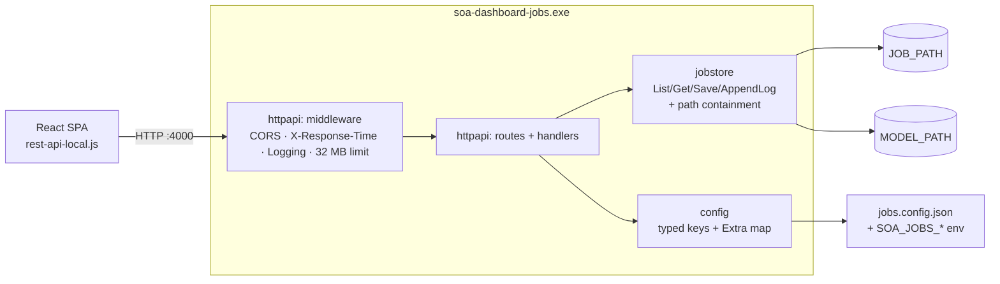

# Design: Go port of `backend-jobs`

Date: 2026-09-21
Status: approved
Source: `C:\dev\soa-dashboard\backend-jobs` (Koa/Node), `C:\dev\soa-dashboard\backend-common\util.js`

## Purpose

`backend-jobs` is the housekeeping backend of the ESB/SOA dashboard. It reads and
writes job definitions, log files and model JSON in local directories on behalf of
the React SPA. It is a small, dependency-heavy Node service (Koa, koa-router,
koa-bodyparser, `@koa/cors`, moment, ramda) that is shipped to Windows machines as
`esb-jobs.exe` via `pkg`.

This project reimplements it in Go as a standalone repository, producing a single
static Windows binary with no Node toolchain and no `pkg`/`ncc` packaging step.

### Why

- **Packaging.** `pkg` downloads Node binaries at build time. Behind the corporate
  proxy this fails and needs the manual `~/.pkg-cache` workaround documented in the
  dashboard README. `go build` produces a self-contained `.exe` offline.
- **Dependencies.** The Node service pulls a transitive dependency tree for what is
  seven routes of file I/O. The Go port has zero third-party dependencies.
- **Separation.** The jobs backend shares nothing with the auth backend except
  ~70 lines of `backend-common/util.js`. It is a natural standalone service.

### Non-goals

- Porting the auth backend (`server.js`, `backend-auth/`). It needs LDAP and stays
  on Node.
- Changing the REST contract. The existing SPA must work against the Go service
  with no frontend change.
- Removing `backend-jobs` from the `soa-dashboard` repo. That is a separate
  decision, taken after this service has run in production.

## Compatibility contract

**Strict drop-in.** Every response body is byte-compatible with the Node original,
including its quirks:

- every response is HTTP 200, including errors
- errors are reported inside the body as `{"result": ...}` or `{"status": ...}`
- job and model file contents are returned as a **raw string**, not parsed JSON

Rationale: the SPA's axios client treats any non-2xx response as an exception and
raises a user-visible error toast. Introducing correct status codes would change
UI behaviour on the "invalid file" and "file not found" paths.

Verified in `frontend/src/components/Jobs.js`: the SPA parses `data.job` and never
inspects the server-supplied `status` string, so Go-flavoured error *text* is safe;
the JSON *shape* is what must match.

## Architecture



Routing uses the Go 1.22 `net/http.ServeMux` method-and-wildcard patterns
(`GET /job/{jobname}`). No router library.

### Repository layout

```
soa-dashboard-jobs/
  go.mod                        module soa-dashboard-jobs (go 1.22)
  main.go                       config load -> mkdir JOB_PATH -> serve -> help banner
  internal/config/config.go     Config{JobPath, ModelPath, Port, Extra}
  internal/jobstore/store.go    ListJobs · GetJob · SaveJob · AppendLog · staysInDirectory
  internal/httpapi/router.go    route table, Server struct
  internal/httpapi/handlers.go  one handler per endpoint
  internal/httpapi/middleware.go CORS · timing · logging · body limit
  internal/httpapi/humanize.go  moment .from() equivalent
  jobs.config.example.json
  build.ps1
  README.md
  .gitignore
```

Each package has one job and is testable on its own: `config` turns files and
environment into a `Config`; `jobstore` is pure filesystem work with no knowledge
of HTTP; `httpapi` is pure HTTP with no knowledge of where files live beyond the
`jobstore` it is handed.

## Components

### `internal/config`

```go
type Config struct {
    JobPath   string
    ModelPath string
    Port      string
    Extra     map[string]string // every key as read, incl. the three above
}
```

Loaded from a JSON file (default `jobs.config.json`, resolved next to the
executable, overridable with `-config`):

```json
{
  "JOB_PATH": "C:/Dashboard",
  "MODEL_PATH": "C:/DashboardModel",
  "LOCAL_SERVER_PORT": "4000",
  "QUEUE_MAP_URL": "http://example.com/ceiser.interfaces/SenderFQN2QueueName.json"
}
```

- All values are strings, matching the JS config object.
- Unknown keys are preserved in `Extra` so `GET /config/{name}` keeps serving
  deployment-specific settings such as `QUEUE_MAP_URL` without a code change.
- Every key may be overridden by the environment variable `SOA_JOBS_<KEY>`, e.g.
  `SOA_JOBS_JOB_PATH=D:/Jobs`. Overrides are applied to `Extra` too, so
  `/checkalive` and `/config/{name}` report the effective value.
- Precedence: env var > config file > built-in default (`LOCAL_SERVER_PORT` only,
  default `4000`).

Port resolution keeps the Node behaviour that a single positional CLI argument
wins over the configured port: `soa-dashboard-jobs.exe 4001`.

### `internal/jobstore`

```go
type Store struct{ JobRoot, ModelRoot string }

func (s *Store) ListJobs() ([]string, error)
func (s *Store) GetJob(name string) (content string, err error)
func (s *Store) GetModel(name string) (content string, err error)
func (s *Store) SaveJob(name, chunk string, append bool) error
func (s *Store) AppendLog(destination string, payload []byte) error
```

`ListJobs` returns the base names of files ending in `.job.json`, and an empty
slice (never an error to the caller) when the directory cannot be scanned, logging
to stderr — matching `jobs.js#listJobs`.

**Path containment** reproduces the Node rule exactly. Node computes
`path.dirname(path.join(root, name)) === path.normalize(root)`; Go computes
`filepath.Dir(filepath.Join(root, name)) == filepath.Clean(root)`. A path is
accepted only if its parent directory *is* the root: subdirectories, `..`
traversal and absolute paths are all rejected. On Windows the comparison is
case-insensitive, matching how the OS resolves the paths.

### `internal/httpapi`

Middleware chain, outermost first:

1. **Body limit** — `http.MaxBytesReader` at 32 MiB, matching `koa-bodyparser`'s
   `jsonLimit: '32mb'`.
2. **CORS** — reproduces the `@koa/cors` defaults: `Access-Control-Allow-Origin`
   is set to the request's `Origin` header when one is present (and omitted when
   it is not), `Vary: Origin` is set, allowed methods are
   `GET, HEAD, PUT, POST, DELETE, PATCH`, the requested
   `Access-Control-Request-Headers` are reflected, and preflight `OPTIONS` is
   answered with 204.
3. **Timing** — sets `X-Response-Time: <ms>` before the body is written.
4. **Logging** — `GET /jobs - 3 ms` to stdout, skipping `/checkalive` and `/log`
   exactly as the Node version does.

All JSON is written with `json.Encoder` and `SetEscapeHTML(false)` so `<`, `>` and
`&` are emitted literally, as `JSON.stringify` does.

## Endpoints

| Route | Request | Response |
|---|---|---|
| `GET /checkalive` | – | `{"result":true,"env":{…},"process-start":"a few seconds ago","uptime-in-ms":1234,"version":"1.2.3"}` |
| `GET /jobs` | – | `{"jobs":["a.job.json", …]}` |
| `GET /job/{jobname}` | – | `{"status":"ok","job":"<raw file>"}` |
| `POST /job/save` | `{"jobname","chunk","append"}` | `{"result":"ok"}` |
| `PUT /log` | `{"destination", …content}` | `{"result":"ok"}` |
| `GET /model/{name}` | – | `{"status":"ok","model":"<raw file>"}` |
| `GET /config/{name}` | – | `{"status":"ok","config":"<value>"}` |

Details:

- `GET /model/{name}` appends `.json`, `PUT /log` appends `.log` and
  `POST /job/save` appends `.job.json`, each unless already present, matching the
  `endsWith` checks in the Node code. `GET /job/{jobname}` deliberately does
  **not** append an extension, also matching Node — the SPA appends `.job.json`
  client-side before calling.
- `POST /job/save` writes `chunk` verbatim (no JSON encoding), truncating unless
  `append` is true. The SPA streams large jobs as 64 KiB appended chunks.
- `PUT /log` appends `<content>,\n` where `<content>` is the request body **minus**
  the `destination` key.
- `GET /config/{name}` returns `{"status":"nok","config":""}` for a missing or
  empty value, reproducing the JS truthiness test `value ? 'ok' : 'nok'`.
- Rejected paths return `{"result":"invalid file"}` (write routes) or
  `{"status":"invalid file"}` (read routes), still with HTTP 200.

### `/checkalive` fields

- `env` — the effective config as a flat string map, i.e. `Config.Extra`.
- `process-start` — a humanised relative time reproducing moment's `.from()`
  output for the English locale: `a few seconds ago`, `a minute ago`,
  `N minutes ago`, `an hour ago`, `N hours ago`, `a day ago`, `N days ago`.
  Implemented in `humanize.go`; no dependency.
- `uptime-in-ms` — integer milliseconds since start.
- `version` — `var version = "dev"` in `main`, set at build time with
  `-ldflags "-X main.version=…"` from the git tag. The Node version read this from
  `frontend/package.json`, which does not exist in this repo.

## Known deltas from the Node original

1. **Error text.** `{"status":"ENOENT: no such file or directory, open '…'"}`
   becomes `{"status":"open C:\\Dashboard\\x.job.json: The system cannot find the file specified."}`.
   Shape identical; the SPA ignores the text.
2. **`/log` key order.** Go maps marshal alphabetically while `JSON.stringify`
   preserves insertion order. `AppendLog` therefore does a token-level rewrite with
   `json.Decoder`, stripping `destination` while preserving the original key order,
   so appended log lines stay consistent with existing files.
3. **Startup `mkdir`.** Node's non-recursive `fs.mkdir` fails when the parent
   directory is missing and the server starts anyway. The Go port uses
   `os.MkdirAll`. Deliberate improvement; startup still continues on failure and
   the banner still reports `(neu angelegt)` when the directory was created.
4. **Configuration format.** `customisation/jobs.config.js` (a CommonJS module)
   becomes `jobs.config.json` plus `SOA_JOBS_*` environment overrides. Go cannot
   `require()` JavaScript.

## Error handling

No route returns a non-2xx status. Filesystem errors are caught at the handler
boundary and rendered into the `result`/`status` field. Panics in a handler are
recovered by `net/http` itself; the process stays up. Startup failures that make
the service useless — an unreadable or malformed config file — log to stderr and
exit non-zero, because there is no sensible degraded mode.

## Testing

`httptest`-driven table tests per handler, each against a `t.TempDir()` job root:

- **Containment:** `../evil`, `sub/dir/x`, absolute paths, and a bare name, for
  both `POST /job/save` and `PUT /log`.
- **Extensions:** `x`, `x.job.json`, `x.json`, `x.log` against the routes that
  append each.
- **Write modes:** truncate vs. append, including the SPA's multi-chunk sequence.
- **Body limit:** a >32 MiB body is rejected without the process growing to match.
- **`/config`:** present, missing, and empty values.
- **`/checkalive`:** all five fields present and typed correctly.
- **`/log` golden test:** exact output bytes, covering key order and HTML escaping.
- **`humanize`:** the boundaries of each moment bucket.

`jobstore` is additionally tested directly, without HTTP.

## Build and delivery

- `go build` for local work; `go test ./...` and `go vet ./...` before each commit.
- `build.ps1` cross-builds `soa-dashboard-jobs.exe` for `windows/amd64` with the
  version stamped from `git describe --tags --always`.
- Fresh repository at `C:\dev\soa-dashboard-jobs`, one commit per plan step.
- `README.md` covers purpose, the architecture diagram, configuration, endpoint
  reference, build, run, and the relationship to the `soa-dashboard` repo.

## Migration

The Go service listens on the same port and speaks the same protocol, so switching
is a matter of running `soa-dashboard-jobs.exe` instead of `esb-jobs.exe` and
translating `customisation/jobs.config.js` into `jobs.config.json`. The README
documents that translation. No frontend change, no rebuild of the SPA.
